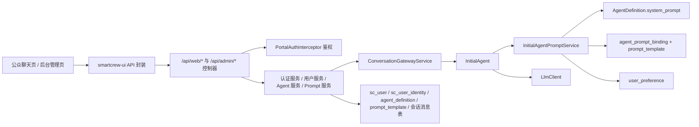

# SmartCrew 当前暂存区改动说明

## 1. 文档目的

本文档用于系统梳理当前 Git 暂存区中的改动内容，重点说明以下几个方面：

- 本轮新增了哪些前端与后端模块
- 每个模块在项目中承担什么职责
- 这些模块之间如何协作
- 数据层、缓存层、接口层、页面层分别发生了什么变化
- 当前整体能力已经能支撑哪些业务场景

本文档对应的改动范围，主要是为了给 SmartCrew 增加一套自有 Web 端与后台管理端，并在尽量不破坏现有 `/api/v1/*` 体系的前提下，补齐用户体系、鉴权、Agent 页面化管理、Prompt 分层配置、长期偏好管理、用户管理与消息记录查看等能力。

---

## 2. 本轮改动的总体目标

本次暂存区改动，围绕以下目标展开：

1. 新增一套自有 Web 交互页面，作为普通用户使用 SmartCrew 的公开入口。
2. 新增一套后台管理系统，支持管理员通过页面管理用户、身份映射、Agent、Prompt、偏好和消息记录。
3. 构建统一用户体系，兼容本地注册用户与飞书、企微等第三方平台用户。
4. 构建可裁剪的接口暴露与鉴权机制，使系统既可以开放 Web/Admin 页面接口，也可以配置为仅开放 `/api/v1/*`。
5. 将现有 Agent 运行体系与数据库配置体系连接起来，使 Agent 既可以先写代码、后补数据库配置，也可以先建数据库占位配置、后补代码实现。
6. 把 Agent 自身的人格提示词与 Prompt 模板库真正串联起来，形成清晰的提示词优先级链路。

---

## 3. 暂存区改动的结构分层

当前暂存区的业务改动，可以分为五层：

### 3.1 公共基础层

位置：

- `smartcrew-common`
- `smartcrew-modules-api`

作用：

- 定义统一配置、认证上下文、接口 DTO/VO、服务接口、数据库实体与 Mapper 接口。
- 这一层不直接承载业务逻辑，而是为上层模块提供“统一约定”。

### 3.2 核心业务实现层

位置：

- `smartcrew-modules`

作用：

- 实现认证、用户、身份映射、聊天网关、消息查询、Prompt 组装、Agent 配置同步、第三方平台用户映射等核心逻辑。

### 3.3 HTTP 接口接入层

位置：

- `smartcrew-admin`

作用：

- 暴露 Web 页面接口与后台管理接口。
- 放置拦截器、CORS 配置、请求日志过滤器等 Web 层能力。

### 3.4 前端页面层

位置：

- `smartcrew-ui`

作用：

- 提供公众聊天页和后台管理页。
- 通过独立路由和布局，把普通用户入口和后台入口分离开来。

### 3.5 数据与测试保障层

位置：

- `sql/init-smartcrew-agent.sql`
- `smartcrew-admin/src/test/resources/sql/test-schema.sql`
- `smartcrew-admin/src/test/java/...`

作用：

- 增加新的业务表结构
- 为新增功能补集成测试和回归测试

---

## 4. 后端改动梳理

## 4.1 公共配置与认证上下文模块

### 4.1.1 `SmartCrewSecurityProperties`

文件：

- `smartcrew-common/src/main/java/com/smartcrew/agent/common/config/SmartCrewSecurityProperties.java`

作用：

- 统一承载 SmartCrew 的接口暴露、鉴权、CORS 和默认管理员初始化配置。
- 它是本轮“可裁剪架构”的配置中心。

它解决的问题：

- 项目后续可能部署成多种模式：
  - 仅开放 `/api/v1/*`
  - 同时开放 `/api/web/*`
  - 同时开放 `/api/admin/*`
- 因此需要一个统一配置对象来决定哪些接口启用、哪些接口需要登录、哪些来源允许跨域访问。

核心能力：

- 控制 `v1/web/admin` 三组接口是否启用
- 控制认证模式是否为 `OFF` 或 `LOCAL_JWT`
- 控制 Web 接口是否要求登录
- 控制后台接口是否要求管理员登录
- 控制 JWT 密钥与过期时间
- 控制 CORS 允许来源
- 控制默认管理员账号初始化

在项目中的角色：

- 它不是业务模块，而是“业务开关中心”。
- `WebMvcPortalConfig`、`PortalAuthInterceptor`、认证服务、管理员初始化逻辑都会读取它。

### 4.1.2 `AuthenticatedUser` 与 `AuthContextHolder`

文件：

- `smartcrew-common/src/main/java/com/smartcrew/agent/common/auth/AuthenticatedUser.java`
- `smartcrew-common/src/main/java/com/smartcrew/agent/common/auth/AuthContextHolder.java`

作用：

- 为当前请求提供统一的登录用户上下文。

设计意义：

- Web 接口与后台接口都需要在请求执行过程中拿到“当前是谁在访问”。
- 这类信息不应层层手工传递，因此用线程上下文保存。

在项目中的角色：

- `PortalAuthInterceptor` 负责把用户写入上下文。
- `WebChatController`、`WebAuthController`、后台管理接口会从上下文读取当前用户。

---

## 4.2 Web 层配置、鉴权与日志模块

### 4.2.1 `WebMvcPortalConfig`

文件：

- `smartcrew-admin/src/main/java/com/smartcrew/agent/config/WebMvcPortalConfig.java`

作用：

- 注册页面接口所需的鉴权拦截器
- 配置 `/api/**` 的跨域规则

它承担的功能角色：

- 是 `smartcrew-admin` 模块里的 Web 基础设施入口。
- 它把 `PortalAuthInterceptor` 接到 `/api/web/**` 与 `/api/admin/**` 两组接口上。
- 同时把 `SmartCrewSecurityProperties` 中的 CORS 配置应用到 Spring MVC。

### 4.2.2 `PortalAuthInterceptor`

文件：

- `smartcrew-admin/src/main/java/com/smartcrew/agent/interceptor/PortalAuthInterceptor.java`

作用：

- 负责解析前端传来的登录 Token
- 根据配置决定是否强制要求登录
- 根据请求路径判断是否需要管理员权限
- 将登录用户写入 `AuthContextHolder`

设计意义：

- 本次没有强依赖 Spring Security，而是选择最小侵入方式实现鉴权。
- 这样可以尽量避免影响现有 `/api/v1/*` 能力。

### 4.2.3 `RequestLoggingFilter`

文件：

- `smartcrew-admin/src/main/java/com/smartcrew/agent/filter/RequestLoggingFilter.java`

作用：

- 后端每收到一次 HTTP 请求时打印一条统一日志。

它的价值：

- 便于排查前后端联调问题
- 便于确认接口是否到达后端
- 满足“收到一次请求打印一条日志即可”的运维诉求

---

## 4.3 认证与登录态模块

### 4.3.1 接口契约

文件：

- `smartcrew-modules-api/src/main/java/com/smartcrew/agent/api/auth/domain/request/LoginRequest.java`
- `smartcrew-modules-api/src/main/java/com/smartcrew/agent/api/auth/domain/request/RegisterRequest.java`
- `smartcrew-modules-api/src/main/java/com/smartcrew/agent/api/auth/domain/vo/LoginResponse.java`
- `smartcrew-modules-api/src/main/java/com/smartcrew/agent/api/auth/domain/vo/CurrentUserVo.java`
- `smartcrew-modules-api/src/main/java/com/smartcrew/agent/api/auth/domain/model/AuthSessionToken.java`
- `smartcrew-modules-api/src/main/java/com/smartcrew/agent/api/auth/domain/model/LoginSessionRecord.java`
- `smartcrew-modules-api/src/main/java/com/smartcrew/agent/api/auth/service/AuthTokenService.java`
- `smartcrew-modules-api/src/main/java/com/smartcrew/agent/api/auth/service/AuthenticationService.java`
- `smartcrew-modules-api/src/main/java/com/smartcrew/agent/api/auth/service/LoginSessionStore.java`

作用：

- 定义认证模块的输入、输出与扩展接口。

特别值得注意的设计点：

- `AuthTokenService` 负责 Token 的创建与解析
- `LoginSessionStore` 负责登录态存储

这样设计的原因：

- 现在登录态先用本地轻量实现
- 后续要换 Redis 时，只需要替换 `LoginSessionStore` 的实现，不需要重写控制器和业务逻辑

### 4.3.2 认证实现

文件：

- `smartcrew-modules/src/main/java/com/smartcrew/agent/core/auth/AuthTokenServiceImpl.java`
- `smartcrew-modules/src/main/java/com/smartcrew/agent/core/auth/AuthenticationServiceImpl.java`
- `smartcrew-modules/src/main/java/com/smartcrew/agent/core/auth/InMemoryLoginSessionStore.java`
- `smartcrew-modules/src/main/java/com/smartcrew/agent/core/auth/AdminAccountBootstrapRunner.java`

作用：

- 完成本地用户名密码注册登录
- 生成 JWT
- 保存会话状态
- 启动时初始化管理员账号

模块职责拆分：

- `AuthenticationServiceImpl`
  - 注册普通用户
  - 登录普通用户
  - 登录管理员
  - 退出登录
  - 查询当前用户
- `AuthTokenServiceImpl`
  - 负责 Token 的编码与解码
- `InMemoryLoginSessionStore`
  - 当前阶段使用内存保存会话状态
  - 为未来切换 Redis 留出接口层
- `AdminAccountBootstrapRunner`
  - 启动时按配置尝试初始化管理员账号
  - 库表未就绪时会跳过，降低对旧环境的影响

在项目中的角色：

- 它们共同组成“页面体系鉴权模块”。
- Web 登录页、后台登录页都依赖它。

---

## 4.4 用户与身份映射模块

### 4.4.1 用户与身份实体定义

文件：

- `smartcrew-modules-api/src/main/java/com/smartcrew/agent/api/user/domain/entity/ScUser.java`
- `smartcrew-modules-api/src/main/java/com/smartcrew/agent/api/user/domain/entity/ScUserIdentity.java`
- `smartcrew-modules-api/src/main/java/com/smartcrew/agent/api/user/domain/vo/ScUserVo.java`
- `smartcrew-modules-api/src/main/java/com/smartcrew/agent/api/user/domain/vo/ScUserIdentityVo.java`
- `smartcrew-modules-api/src/main/java/com/smartcrew/agent/api/user/mapper/ScUserMapper.java`
- `smartcrew-modules-api/src/main/java/com/smartcrew/agent/api/user/mapper/ScUserIdentityMapper.java`
- `smartcrew-modules-api/src/main/java/com/smartcrew/agent/api/user/service/UserAccountService.java`
- `smartcrew-modules-api/src/main/java/com/smartcrew/agent/api/user/service/UserIdentityService.java`
- `smartcrew-modules-api/src/main/java/com/smartcrew/agent/api/user/service/UserIdentityResolver.java`

设计意图：

- `sc_user` 表保存“系统用户”
- `sc_user_identity` 表保存“外部身份映射”

这套设计支持两类人进入系统：

- 本地自己注册的用户
- 从飞书、企微等外部平台接入的用户

### 4.4.2 用户与身份实现

文件：

- `smartcrew-modules/src/main/java/com/smartcrew/agent/core/user/UserAccountServiceImpl.java`
- `smartcrew-modules/src/main/java/com/smartcrew/agent/core/user/UserIdentityServiceImpl.java`
- `smartcrew-modules/src/main/java/com/smartcrew/agent/core/user/UserIdentityResolverImpl.java`

职责说明：

- `UserAccountServiceImpl`
  - 用户注册
  - 本地账号认证
  - 用户状态修改
  - 用户列表与详情查询
  - 创建第三方平台自动注册用户
- `UserIdentityServiceImpl`
  - 管理员视角下的身份绑定与解绑
  - 查询某个用户绑定了哪些第三方身份
- `UserIdentityResolverImpl`
  - 第三方平台消息进入系统时，按 `provider + providerUserId + tenantKey` 解析用户
  - 若不存在映射，则自动创建平台用户并建立绑定

在项目中的角色：

- 这是“统一用户模型”的核心。
- 它让 Web 用户与第三方平台用户最终都汇聚为同一套系统用户。

---

## 4.5 聊天网关与会话查询模块

### 4.5.1 聊天领域接口

文件：

- `smartcrew-modules-api/src/main/java/com/smartcrew/agent/api/chat/domain/request/SendChatMessageRequest.java`
- `smartcrew-modules-api/src/main/java/com/smartcrew/agent/api/chat/domain/vo/ChatSessionVo.java`
- `smartcrew-modules-api/src/main/java/com/smartcrew/agent/api/chat/domain/vo/ChatMessageVo.java`
- `smartcrew-modules-api/src/main/java/com/smartcrew/agent/api/chat/service/ConversationGatewayService.java`
- `smartcrew-modules-api/src/main/java/com/smartcrew/agent/api/chat/service/ConversationQueryService.java`

作用：

- 统一定义 Web 聊天与后台消息查询要使用的数据模型与服务接口。

### 4.5.2 核心实现

文件：

- `smartcrew-modules/src/main/java/com/smartcrew/agent/core/chat/ConversationGatewayServiceImpl.java`
- `smartcrew-modules/src/main/java/com/smartcrew/agent/core/chat/ConversationQueryServiceImpl.java`

职责说明：

- `ConversationGatewayServiceImpl`
  - 是消息进入 Agent 体系前的统一入口
  - Web 聊天与平台聊天都先走它
  - 它负责为不同来源构造统一的根会话 ID
  - 它将请求转交给 `initial-agent`
- `ConversationQueryServiceImpl`
  - 提供会话列表与消息列表查询
  - 既服务普通 Web 用户，也服务后台管理员

关键设计点：

- Web 会话与平台会话通过不同命名规则统一落入同一会话体系
- 会话查询与消息发送分离，便于后续演化成更多入口和更多查询方式

在项目中的角色：

- 它是“页面聊天能力”与“后台消息审计能力”的桥梁层。

---

## 4.6 Agent 管理与运行时同步模块

### 4.6.1 `AgentDefinitionService` 与 `AgentDefinitionVo` 扩展

文件：

- `smartcrew-modules-api/src/main/java/com/smartcrew/agent/api/agent/service/AgentDefinitionService.java`
- `smartcrew-modules-api/src/main/java/com/smartcrew/agent/api/agent/domain/vo/AgentDefinitionVo.java`
- `smartcrew-modules/src/main/java/com/smartcrew/agent/core/agent/service/AgentDefinitionServiceImpl.java`

本轮重点改动：

- Agent 列表不再只看数据库配置
- 现在改成“数据库 Agent + 运行时代码 Agent”统一合并展示

新增的重要视图字段：

- `sourceStatus`
  - `CODE_ONLY`
  - `DB_ONLY`
  - `LINKED`
- `hasCodeBean`
- `hasDatabaseConfig`
- `beanClassName`
- `runtimeMode`

这套设计解决的问题：

- 某些 Agent 可能已经写了代码，但数据库里还没有对应配置
- 某些 Agent 可能先在数据库里建了占位记录，代码还没实现
- 管理页面需要把这两种来源放到一个统一视图里

### 4.6.2 `InitialAgent` 统一聊天入口

文件：

- `smartcrew-modules/src/main/java/com/smartcrew/agent/core/agent/InitialAgent.java`

作用：

- 作为当前 Web 与第三方平台聊天的统一 Agent 入口

设计意义：

- 先把所有页面与平台消息收敛到同一个初始智能体
- 便于后续从单 Agent 演进到多 Agent 协调

在项目中的角色：

- 它是当前 SmartCrew“对外统一聊天入口”的执行体。

---

## 4.7 Prompt 分层与 Agent Prompt 绑定模块

### 4.7.1 新增 Agent Prompt 绑定模型

文件：

- `smartcrew-modules-api/src/main/java/com/smartcrew/agent/api/prompt/domain/entity/AgentPromptBinding.java`
- `smartcrew-modules-api/src/main/java/com/smartcrew/agent/api/prompt/domain/vo/AgentPromptBindingVo.java`
- `smartcrew-modules-api/src/main/java/com/smartcrew/agent/api/prompt/mapper/AgentPromptBindingMapper.java`
- `smartcrew-modules-api/src/main/java/com/smartcrew/agent/api/prompt/service/AgentPromptBindingService.java`
- `smartcrew-modules/src/main/java/com/smartcrew/agent/core/prompt/AgentPromptBindingServiceImpl.java`

作用：

- 允许一个 Agent 绑定多个具体 Prompt 模板
- 允许这些模板按顺序拼接
- 绑定的是具体模板记录，而不是仅按分类模糊绑定

设计意义：

- `agent_definition.system_prompt` 负责 Agent 自身的人格、风格、安全边界
- `prompt_template` 负责工作流模板、任务步骤和执行规则
- 通过绑定表把两层配置真正串起来

### 4.7.2 `InitialAgentPromptService`

文件：

- `smartcrew-modules/src/main/java/com/smartcrew/agent/core/agent/service/InitialAgentPromptService.java`
- `smartcrew-modules/src/main/java/com/smartcrew/agent/core/agent/service/InitialAgentPromptServiceImpl.java`

作用：

- 负责按 Agent 维度组装最终系统提示词

当前固定优先级：

1. `agent_definition.system_prompt`
2. Agent 绑定的多个 `prompt_template`
3. 用户长期偏好
4. 三层都为空时使用默认兜底 Prompt

这部分在项目中的角色：

- 它是 Prompt 配置真正生效的运行时组装器。
- 后台上修改 Agent 基础人格 Prompt、调整工作流模板顺序、修改用户偏好，最终都通过它汇总成发给 LLM 的系统提示词。

### 4.7.3 为什么这一层重要

此前系统中存在两个看似都能写 Prompt 的位置：

- `agent_definition.system_prompt`
- `prompt_template`

但运行时并没有明确把它们串起来。

本轮改动后，两者关系被明确化：

- `agent_definition.system_prompt` 是 Agent 的基础人格层
- `prompt_template` 是 Agent 的流程模板层
- 两者不是重复关系，而是上下分层关系

---

## 4.8 第三方平台接入改造

文件：

- `smartcrew-modules/src/main/java/com/smartcrew/agent/core/platform/FeishuPlatformAdapter.java`
- `smartcrew-modules/src/main/java/com/smartcrew/agent/core/platform/WecomPlatformAdapter.java`

作用：

- 让飞书与企微进入系统的消息不再只是占位逻辑
- 改为通过统一身份解析、统一会话构造、统一 Agent 网关进入系统

它们承担的角色：

- 是第三方平台进入 SmartCrew 的适配层
- 它们不直接负责复杂业务，只负责把平台事件转换成系统内部统一格式

---

## 4.9 Web 与后台控制器模块

### 4.9.1 Web 端控制器

文件：

- `smartcrew-admin/src/main/java/com/smartcrew/agent/controller/web/WebAuthController.java`
- `smartcrew-admin/src/main/java/com/smartcrew/agent/controller/web/WebChatController.java`

作用：

- `WebAuthController`
  - 普通用户注册、登录、登出、查看当前用户
- `WebChatController`
  - 创建会话
  - 查询自己的历史会话
  - 查询某个会话的消息
  - 发送消息给 `initial-agent`

这些接口只服务公众 Web 页面，不对后台管理页开放。

### 4.9.2 后台管理控制器

文件：

- `AdminAuthController`
- `AdminUserController`
- `AdminPromptController`
- `AdminPreferenceController`
- `AdminConversationController`
- `AdminAgentController`

它们分别承担的角色如下：

- `AdminAuthController`
  - 后台管理员登录与登出
- `AdminUserController`
  - 用户列表、用户详情、状态切换
  - 用户身份映射查看、绑定、解绑
- `AdminPromptController`
  - Prompt 模板库维护
- `AdminPreferenceController`
  - 用户长期偏好查看、编辑、删除
- `AdminConversationController`
  - 查询会话列表和消息记录
- `AdminAgentController`
  - 查看统一 Agent 列表
  - 新建数据库 Agent
  - 编辑数据库 Agent
  - 查看和更新 Agent 的 Prompt 绑定关系

其中 `AdminAgentController` 是本轮后台管理改造里最核心的控制器之一，因为它同时承接了：

- Agent 数据库配置管理
- 代码 Agent 与数据库 Agent 的统一展示
- Agent 基础人格 Prompt 管理
- 工作流 Prompt 模板绑定管理

---

## 4.10 配置文件与依赖调整

### 4.10.1 配置文件

文件：

- `smartcrew-admin/src/main/resources/application.yml`
- `smartcrew-admin/src/main/resources/application-dev.yml`
- `smartcrew-admin/src/test/resources/application-test.yml`

作用：

- 增加 SmartCrew 页面体系相关配置项
- 增加 CORS 与鉴权模式配置
- 增加测试环境下的页面接口与认证配置

### 4.10.2 模块依赖

文件：

- `smartcrew-modules/pom.xml`

作用：

- 为本轮新增的认证、用户、JWT、页面服务等能力补充必要依赖

---

## 5. 前端改动梳理

## 5.1 新增独立前端工程 `smartcrew-ui`

位置：

- `smartcrew-ui`

技术栈：

- Vue 3
- Vite
- TypeScript
- Vue Router
- Pinia
- Element Plus
- Sass

这个工程的定位：

- 是 SmartCrew 新增的自有页面端
- 不是原系统接口的替代者，而是新增的一层展示与交互界面

---

## 5.2 前端基础结构模块

### 5.2.1 工程入口与构建配置

文件：

- `smartcrew-ui/package.json`
- `smartcrew-ui/vite.config.ts`
- `smartcrew-ui/index.html`
- `smartcrew-ui/src/main.ts`
- `smartcrew-ui/src/App.vue`
- `smartcrew-ui/.env.example`

作用：

- 构建前端应用
- 配置开发代理
- 配置后端地址
- 挂载 Vue 应用

### 5.2.2 运行配置模块

文件：

- `smartcrew-ui/src/config/portal.ts`

作用：

- 提供前端运行时配置
- 包括是否启用 Web 页面、是否启用后台页面、后端基础地址等

它的角色：

- 是前端与后端“可裁剪部署”思路在页面侧的映射

---

## 5.3 前端网络与状态模块

### 5.3.1 HTTP 封装

文件：

- `smartcrew-ui/src/api/http.ts`
- `smartcrew-ui/src/api/portal.ts`

作用：

- `http.ts`
  - 统一封装请求发送与响应解包
  - 兼容后端 `R<T>` 和 `TableDataInfo` 两种响应结构
- `portal.ts`
  - 按业务域封装 Web API 与 Admin API

这部分的角色：

- 是前端所有页面的数据入口层

### 5.3.2 状态管理

文件：

- `smartcrew-ui/src/stores/auth.ts`
- `smartcrew-ui/src/stores/chat.ts`

作用：

- `auth.ts`
  - 管理 Web 登录态与后台登录态
  - 支持本地持久化
- `chat.ts`
  - 管理当前聊天会话、会话列表、消息列表与发送状态

设计意义：

- 把登录状态与聊天状态从页面组件里抽离出来
- 让页面只负责显示，业务状态由 Store 统一维护

---

## 5.4 路由与布局模块

### 5.4.1 路由

文件：

- `smartcrew-ui/src/router/index.ts`

作用：

- 配置公众页面和后台页面的路由结构
- 增加路由守卫

具体路由结构：

- `/`
  - 公众聊天页
- `/admin/login`
  - 后台登录页
- `/admin/dashboard`
  - 后台首页
- `/admin/users`
  - 用户管理
- `/admin/identities`
  - 身份映射管理
- `/admin/agents`
  - Agent 管理
- `/admin/prompts`
  - Prompt 配置
- `/admin/preferences`
  - 偏好管理
- `/admin/conversations`
  - 消息记录

### 5.4.2 布局

文件：

- `smartcrew-ui/src/layouts/PublicLayout.vue`
- `smartcrew-ui/src/layouts/AdminLayout.vue`

作用：

- 把普通用户页面和后台页面的视觉结构隔离开
- 便于各自单独扩展

---

## 5.5 公共组件与样式系统

文件：

- `smartcrew-ui/src/components/common/GlassPanel.vue`
- `smartcrew-ui/src/components/public/AuthDialog.vue`
- `smartcrew-ui/src/styles/base.scss`

作用：

- `GlassPanel.vue`
  - 统一封装玻璃拟态卡片容器
  - 在公众页与后台页复用
- `AuthDialog.vue`
  - 封装公众页登录/注册弹窗
- `base.scss`
  - 提供全局主题变量、基础字体、背景与玻璃质感样式

这些模块的角色：

- 它们构成了新的前端设计系统基础层。

---

## 5.6 公众聊天端页面

文件：

- `smartcrew-ui/src/views/public/PublicChatView.vue`

作用：

- 提供面向普通用户的公开聊天界面

页面结构：

- 左侧栏
  - 个人信息入口
  - 登录/注册入口
  - 历史会话列表
  - 新建会话
- 右侧主区域
  - 品牌展示
  - 快捷问题卡
  - 聊天消息区
  - 输入框与发送操作

它在项目中的角色：

- 是 SmartCrew 首个自有用户界面
- 负责把 `/api/web/*` 接口变成可视化产品能力

---

## 5.7 后台管理端页面

文件：

- `smartcrew-ui/src/views/admin/AdminLoginView.vue`
- `smartcrew-ui/src/views/admin/AdminDashboardView.vue`
- `smartcrew-ui/src/views/admin/AdminUsersView.vue`
- `smartcrew-ui/src/views/admin/AdminIdentitiesView.vue`
- `smartcrew-ui/src/views/admin/AdminAgentsView.vue`
- `smartcrew-ui/src/views/admin/AdminPromptsView.vue`
- `smartcrew-ui/src/views/admin/AdminPreferencesView.vue`
- `smartcrew-ui/src/views/admin/AdminConversationsView.vue`

各页面的功能角色如下：

- `AdminLoginView.vue`
  - 管理员登录入口
- `AdminDashboardView.vue`
  - 后台概览页
  - 用于承接整体管理台的首页角色
- `AdminUsersView.vue`
  - 平台用户管理
- `AdminIdentitiesView.vue`
  - 第三方身份映射管理
- `AdminAgentsView.vue`
  - Agent 统一管理入口
  - 可查看代码 Agent、数据库 Agent 和已关联 Agent
  - 可新建数据库 Agent
  - 可为代码 Agent 创建数据库信息
  - 可维护 Agent 基础人格 Prompt
  - 可绑定多个工作流 Prompt 模板并调整顺序
- `AdminPromptsView.vue`
  - Prompt 模板库维护入口
- `AdminPreferencesView.vue`
  - 用户长期偏好管理
- `AdminConversationsView.vue`
  - 用户消息记录与会话记录查询

其中 `AdminAgentsView.vue` 是本次前端改造中最重要的页面之一，因为它承接了 Agent 配置分层设计的可视化入口。

---

## 6. 数据库结构改动

主要文件：

- `sql/init-smartcrew-agent.sql`
- `smartcrew-admin/src/test/resources/sql/test-schema.sql`

本轮新增或调整的核心数据结构包括：

### 6.1 用户相关

- `sc_user`
  - 系统内部统一用户
- `sc_user_identity`
  - 外部身份映射

### 6.2 Agent 与 Prompt 相关

- `agent_definition`
  - Agent 的数据库配置
  - 其中 `system_prompt` 负责 Agent 基础人格层
- `prompt_template`
  - Prompt 模板库
  - 负责工作流模板层
- `agent_prompt_binding`
  - 新增
  - 用于把某个 Agent 与多个具体 Prompt 模板记录绑定起来
  - 支持顺序控制

### 6.3 会话与消息相关

- 继续复用现有会话与消息表，不额外新建一套聊天消息存储结构

这套设计的意义：

- 最大限度复用现有能力
- 通过少量新增表支撑新的页面与管理需求

---

## 7. 模块之间的关联关系

下面用一条简化链路说明当前系统的协作方式。

简要解释如下：

1. 前端页面并不直接操作数据库，而是通过 `/api/web/*` 与 `/api/admin/*` 访问后端。
2. 页面接口先经过 `PortalAuthInterceptor` 做登录与角色校验。
3. 用户管理、Agent 管理、Prompt 管理、偏好管理、消息查询分别落到对应的业务服务。
4. 当用户从 Web 页面或第三方平台发起聊天时，消息统一进入 `ConversationGatewayService`。
5. `ConversationGatewayService` 统一调用 `InitialAgent`。
6. `InitialAgent` 通过 `InitialAgentPromptService` 组装最终提示词。
7. 最终提示词由三层构成：
   - Agent 基础人格层
   - 工作流模板层
   - 用户偏好层
8. 然后调用 LLM 客户端完成回复。

---

## 8. 测试与验证改动

文件：

- `smartcrew-admin/src/test/java/com/smartcrew/agent/AgentPromptIntegrationTests.java`
- `smartcrew-admin/src/test/java/com/smartcrew/agent/SmartCrewAgentApplicationTests.java`
- `smartcrew-admin/src/test/resources/application-test.yml`
- `smartcrew-admin/src/test/resources/sql/test-schema.sql`

这部分新增的价值：

- 验证 Agent 新增或更新后，运行时缓存是否同步刷新
- 验证 Prompt 分层拼装是否按预期生效
- 验证 Prompt 模板绑定顺序是否正确
- 验证模板缺失时是否跳过并记录警告
- 验证新增接口不会破坏现有主流程

---

## 9. 当前暂存区改动带来的最终能力

截至当前暂存区，系统已经具备以下能力：

- 自有公众聊天 Web 页面
- 自有后台管理系统
- 本地注册登录与后台管理员登录
- 可配置的 Web/Admin 接口启用与鉴权边界
- 统一用户体系与第三方身份映射
- Web 会话创建、历史会话查询、消息查询与聊天发送
- 后台用户管理、身份映射管理、Prompt 管理、偏好管理、消息记录查看
- 统一的 Agent 列表视图，兼容代码 Agent 与数据库 Agent
- 后台创建数据库 Agent
- 为仅代码 Agent 创建数据库信息
- 为 Agent 配置基础人格 Prompt
- 为 Agent 绑定多个工作流 Prompt 模板并控制顺序
- 将 Agent Prompt、Prompt 模板、用户偏好统一串联到 `InitialAgent` 的运行时提示词中

---

## 10. 需要注意的事项

### 10.1 暂存区中也包含少量非业务文件

例如：

- `.gitignore`
- `.idea/compiler.xml`

这些文件主要是工程环境辅助修改，不属于核心业务模块。

### 10.2 现有已知问题

当前测试整体通过，但项目中仍存在一个已知的旧问题：

- DashScope 流式回调线程会打印 `IllegalMonitorStateException`

这个问题不影响本轮新增的 Web/Admin、用户体系、Agent 管理和 Prompt 分层功能，但后续建议单独排查。

---

## 11. 总结

本轮暂存区改动，本质上是在原有 SmartCrew Agent 能力基础上，新搭建了一套“可配置页面服务层 + 自有前端 + 后台运营能力 + 统一用户体系 + Prompt 分层配置体系”。

如果用一句话概括当前架构升级的意义，可以表述为：

> SmartCrew 已经从“以 `/api/v1/*` 为中心的 Agent 能力项目”，升级为“同时具备自有 Web 产品入口、后台管理入口、统一用户模型和 Prompt 分层配置能力的平台化系统”。

