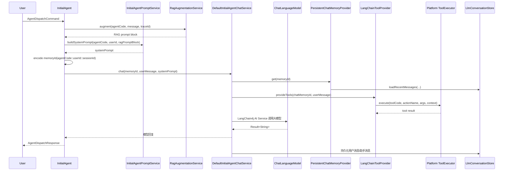

# SmartCrew 中基于 LangChain4j 的聊天链路解析

> 版本：v1.0
> 适用范围：`initial-agent` 主聊天链路、LangChain4j 接入层、对话记忆、Tool Calling
> 目标读者：需要维护 SmartCrew Agent 聊天能力的后端开发同学

---

## 1. 文档目标

本文结合本项目当前实现，说明 `DefaultInitialAgentChatService` 以及相关代码块是如何完成一条聊天请求链路的，重点回答下面三个问题：

1. 大模型是如何加载的，`ChatLanguageModel` 读取了哪些配置。
2. 对话上下文是如何加载和持久化的，`ChatMemoryProvider` 做了什么。
3. 工具调用是如何按 Agent 动态管理并执行的，`ToolProvider` 如何接入。

如果你只想先快速建立整体认识，可以先看第 2 节的链路总览图。

---

## 2. 一张图看懂整体链路



从职责上看，可以把这条链路拆成四层：

- `InitialAgent`：业务入口，负责拼装 prompt、RAG、会话锁和降级处理。
- `DefaultInitialAgentChatService`：LangChain4j AI Service 适配层，把模型、记忆、工具装起来。
- `ChatLanguageModel` / `ChatMemoryProvider` / `ToolProvider`：LangChain4j 运行时三件套。
- `LlmConversationStore` / Tool 基础设施：项目自己的持久化与工具执行实现。

---

## 3. 聊天入口：`InitialAgent` 如何发起一次推理

真正的业务入口不是 `DefaultInitialAgentChatService`，而是 [`InitialAgent`](../../smartcrew-modules/src/main/java/com/smartcrew/agent/core/agent/InitialAgent.java)。它负责把一次用户消息整理成适合 LangChain4j 调用的输入。

关键流程如下：

```java
public AgentDispatchResponse handle(AgentDispatchCommand command) {
    InitialAgentChatService chatService = chatServiceProvider.getIfAvailable();
    if (chatService == null) {
        persistFallbackConversation(command, "当前未启用大模型服务");
        return AgentDispatchResponse.builder().accepted(false).build();
    }

    RagAugmentationResult augmentationResult = resolveRagAugmentation(command);
    String memoryId = InitialAgentMemoryId.encode(code(), command.getUserId(), command.getSessionId());
    String systemPrompt = promptService.buildSystemPrompt(
            code(), command.getUserId(), augmentationResult.getPromptBlock());

    ReentrantLock lock = conversationLocks.computeIfAbsent(conversationKey, key -> new ReentrantLock());
    lock.lock();
    try {
        ToolCallContextHolder.set(command.getTraceId(), command.getContext());
        Result<String> result = chatService.chat(memoryId, command.getMessage(), systemPrompt);
        return AgentDispatchResponse.builder()
                .accepted(true)
                .message(result == null ? "" : result.content())
                .build();
    } finally {
        ToolCallContextHolder.clear();
        lock.unlock();
    }
}
```

这里有几个关键点：

- `chatServiceProvider.getIfAvailable()`：允许在 `smartcrew.llm.enabled=false` 时不注入聊天服务，实现配置化开关。
- `resolveRagAugmentation(...)`：如果启用了 RAG，会先把知识库召回内容拼成额外的 prompt block。
- `InitialAgentMemoryId.encode(...)`：把当前 Agent、用户、会话编码成统一的 `memoryId`，后续记忆加载和工具上下文都靠它定位。
- `conversationLocks`：按 `userId + sessionId` 加锁，避免并发请求把同一会话上下文写乱。
- `ToolCallContextHolder`：把 `traceId` 和业务上下文塞进 `ThreadLocal`，后面记忆持久化和工具执行都能读到。

也就是说，`InitialAgent` 负责“准备战场”，`DefaultInitialAgentChatService` 才负责真正调用 LangChain4j。

---

## 4. `DefaultInitialAgentChatService`：LangChain4j AI Service 装配层

[`DefaultInitialAgentChatService`](../../smartcrew-modules/src/main/java/com/smartcrew/agent/core/agent/service/DefaultInitialAgentChatService.java) 的核心工作很纯粹：把模型、记忆、工具三者组装成一个 LangChain4j `AiService`。

核心代码如下：

```java
public DefaultInitialAgentChatService(ChatLanguageModel chatLanguageModel,
                                      ChatMemoryProvider chatMemoryProvider,
                                      ToolProvider toolProvider) {
    this.assistant = AiServices.builder(InitialAgentAssistant.class)
            .chatLanguageModel(chatLanguageModel)
            .chatMemoryProvider(chatMemoryProvider)
            .toolProvider(toolProvider)
            .build();
}

interface InitialAgentAssistant {

    @SystemMessage("{{systemPrompt}}")
    Result<String> chat(@MemoryId String memoryId,
                        @UserMessage String userMessage,
                        @V("systemPrompt") String systemPrompt);
}
```

这段代码基本决定了本项目与 LangChain4j 的集成方式：

- `AiServices.builder(...)`：由 LangChain4j 为接口生成运行时代理。
- `.chatLanguageModel(chatLanguageModel)`：指定底层大模型实现。
- `.chatMemoryProvider(chatMemoryProvider)`：指定会话记忆的加载方式。
- `.toolProvider(toolProvider)`：指定本轮可用工具集合。

`InitialAgentAssistant.chat(...)` 上的几个注解决定了消息是怎么送进模型的：

| 注解 | 作用 | 本项目中的含义 |
| :--- | :--- | :--- |
| `@SystemMessage("{{systemPrompt}}")` | 声明系统提示词模板 | 使用调用参数里的 `systemPrompt` 作为系统消息 |
| `@UserMessage` | 声明用户输入 | 用户本轮消息 |
| `@MemoryId` | 声明记忆键 | 用于加载历史消息和隔离会话 |
| `@V("systemPrompt")` | 模板变量 | 把方法参数注入到 `@SystemMessage` 模板 |

因此，`DefaultInitialAgentChatService.chat(memoryId, userMessage, systemPrompt)` 本质上是在告诉 LangChain4j：

1. 用哪个会话记忆窗口。
2. 本轮系统提示词是什么。
3. 本轮用户输入是什么。
4. 本轮允许模型调用哪些工具。

---

## 5. 大模型是如何加载的

### 5.1 配置来源

本项目的大模型配置来自 Spring Boot 配置文件。

`smartcrew-admin/src/main/resources/application.yml` 中定义了开关、Provider 和模型名：

```yml
smartcrew:
  llm:
    enabled: true
    provider: dashscope
    model: qwen-plus
```

`smartcrew-admin/src/main/resources/application-dev.yml` 中补充敏感配置：

```yml
smartcrew:
  llm:
    api-key: ${DASHSCOPE_API_KEY:}
```

如果需要兼容私有网关，也可以配置：

```yml
smartcrew:
  llm:
    base-url: http://your-gateway
```

### 5.2 配置如何绑定到 Java 对象

[`SmartCrewProperties`](../../smartcrew-common/src/main/java/com/smartcrew/agent/common/config/SmartCrewProperties.java) 通过 `@ConfigurationProperties(prefix = "smartcrew")` 读取整棵配置树，其中 `Llm` 内部类承载模型配置：

```java
@Component
@ConfigurationProperties(prefix = "smartcrew")
public class SmartCrewProperties {

    private Llm llm = new Llm();

    @Data
    public static class Llm {
        private boolean enabled;
        private String provider;
        private String baseUrl;
        private String apiKey;
        private String model;
    }
}
```

所以，`smartcrew.llm.*` 会先被绑定进 `SmartCrewProperties.Llm`。

### 5.3 `ChatLanguageModel` Bean 的创建过程

真正把配置变成 LangChain4j 模型 Bean 的，是 [`LlmConfig`](../../smartcrew-modules/src/main/java/com/smartcrew/agent/core/config/LlmConfig.java)：

```java
@Configuration
@ConditionalOnProperty(prefix = "smartcrew.llm", name = "enabled", havingValue = "true")
public class LlmConfig {

    @Bean
    @ConditionalOnMissingBean(ChatLanguageModel.class)
    public ChatLanguageModel chatLanguageModel() {
        SmartCrewProperties.Llm llmConfig = requireDashScope();
        QwenChatModel.QwenChatModelBuilder builder = QwenChatModel.builder()
                .apiKey(llmConfig.getApiKey())
                .modelName(llmConfig.getModel())
                .temperature(0.7F)
                .maxTokens(2048);
        if (StringUtils.isNotBlank(llmConfig.getBaseUrl())) {
            builder.baseUrl(llmConfig.getBaseUrl());
        }
        return builder.build();
    }
}
```

这里体现出几个重要实现约束：

- 只有当 `smartcrew.llm.enabled=true` 时，这个配置类才会生效。
- 当前只支持 `dashscope`，由 `requireDashScope()` 校验 `provider/apiKey/model`。
- 如果容器里已经有别的 `ChatLanguageModel` Bean，`@ConditionalOnMissingBean` 会避免重复注册，方便后续扩展。
- 当前项目固定使用 `QwenChatModel`，并设置：
  - `temperature = 0.7F`
  - `maxTokens = 2048`
  - `baseUrl` 可选覆盖

### 5.4 这一层在链路中的位置

`DefaultInitialAgentChatService` 并不关心配置文件，它只依赖 `ChatLanguageModel` Bean。  
换句话说，配置读取发生在 Spring 启动期，聊天服务只是消费已经装配好的模型实例。

---

## 6. 上下文是如何加载的：`ChatMemoryProvider` 与持久化记忆

### 6.1 `memoryId` 是上下文隔离的关键

本项目没有把对话上下文散落在多个地方，而是统一编码为：

```java
agentCode::userId::sessionId
```

对应实现见 [`InitialAgentMemoryId`](../../smartcrew-modules/src/main/java/com/smartcrew/agent/core/agent/service/InitialAgentMemoryId.java)：

```java
public record InitialAgentMemoryId(String agentCode, Long userId, String sessionId) {

    public static String encode(String agentCode, Long userId, String sessionId) {
        return agentCode + "::" + userId + "::" + sessionId;
    }

    public String persistedSessionId() {
        return agentCode + "::" + sessionId;
    }
}
```

这里有两个层次的 ID：

- LangChain4j 运行时记忆 ID：`agentCode::userId::sessionId`
- 数据库存储用会话 ID：`agentCode::sessionId`

也就是说，用户隔离依赖 `userId + sessionId`，而数据库中的会话名则额外带上 `agentCode`，避免不同 Agent 共用同一 `sessionId` 时冲突。

### 6.2 `PersistentChatMemoryProvider`：按会话创建记忆对象

[`PersistentChatMemoryProvider`](../../smartcrew-modules/src/main/java/com/smartcrew/agent/core/llm/memory/PersistentChatMemoryProvider.java) 很薄，只负责按 `memoryId` 创建一个 `PersistentChatMemory`：

```java
@Component
public class PersistentChatMemoryProvider implements ChatMemoryProvider {

    private final LlmConversationStore conversationStore;

    @Override
    public ChatMemory get(Object memoryId) {
        return new PersistentChatMemory(memoryId, conversationStore);
    }
}
```

它不缓存，也不做窗口裁剪。真正的历史加载和消息持久化都在 `PersistentChatMemory` 中完成。

### 6.3 `PersistentChatMemory`：加载历史 + 写回消息

[`PersistentChatMemory`](../../smartcrew-modules/src/main/java/com/smartcrew/agent/core/llm/memory/PersistentChatMemory.java) 是本项目对 LangChain4j `ChatMemory` 的核心实现。

初始化时会做两件事：

```java
public PersistentChatMemory(Object memoryId, LlmConversationStore conversationStore) {
    this.memoryId = memoryId;
    this.conversationStore = conversationStore;
    this.parsedMemoryId = InitialAgentMemoryId.parse(memoryId);
    this.conversationStore.ensureSession(parsedMemoryId.userId(), parsedMemoryId.persistedSessionId());
    loadHistory();
}
```

含义分别是：

1. 解析 `memoryId`，拿到 `agentCode/userId/sessionId`。
2. 确保数据库中存在对应会话。
3. 加载最近历史消息到内存窗口。

历史加载窗口固定为 20 条：

```java
private static final int HISTORY_WINDOW_SIZE = 20;

private void loadHistory() {
    List<LlmConversationMessage> historyMessages = conversationStore.loadRecentMessages(
            parsedMemoryId.userId(),
            parsedMemoryId.persistedSessionId(),
            HISTORY_WINDOW_SIZE
    );
    ...
}
```

### 6.4 不同消息类型如何处理

`PersistentChatMemory.add(...)` 的处理逻辑很值得单独看一下：

```java
@Override
public void add(ChatMessage message) {
    if (message instanceof SystemMessage systemMessage) {
        upsertSystemMessage(systemMessage);
        return;
    }
    messages.add(message);
    if (message instanceof UserMessage userMessage) {
        persistUserMessage(userMessage);
        return;
    }
    if (message instanceof AiMessage aiMessage
            && !aiMessage.hasToolExecutionRequests()
            && StringUtils.isNotBlank(aiMessage.text())) {
        persistAssistantMessage(aiMessage);
    }
}
```

对应关系如下：

| 消息类型 | 处理方式 | 是否持久化 |
| :--- | :--- | :--- |
| `SystemMessage` | 只保留在内存窗口首位 | 否 |
| `UserMessage` | 加入窗口 | 是 |
| `AiMessage`（普通文本回复） | 加入窗口 | 是 |
| `AiMessage`（包含 tool requests） | 加入窗口 | 否 |

这里有两个项目级实现细节要注意：

- `SystemMessage` 不落库，只在本轮记忆窗口中使用。
- 带有 `ToolExecutionRequests` 的 `AiMessage` 不落库，说明当前数据库里只保存最终文本对话，不保存工具中间步骤。

另外，`upsertSystemMessage(...)` 会强制把系统消息放到首位，这是因为当前使用的 Qwen 适配层对 system message 顺序比较敏感。

### 6.5 记忆最终落到哪里

底层持久化由 [`LlmConversationStoreImpl`](../../smartcrew-modules/src/main/java/com/smartcrew/agent/core/llm/LlmConversationStoreImpl.java) 完成。

它主要提供四类能力：

- `ensureSession(...)`：确保会话存在。
- `loadRecentMessages(...)`：读取最近 N 条消息。
- `nextMessageSeq(...)`：生成递增消息序号。
- `saveUserMessage(...)` / `saveAssistantMessage(...)`：保存消息并刷新会话统计。

核心保存逻辑如下：

```java
public LlmConversationMessage saveUserMessage(Long userId,
                                              String sessionId,
                                              long messageSeq,
                                              String content,
                                              String traceId) {
    message.setRole(ConversationHistoryEnum.USER.getCode());
    message.setContent(content);
    message.setTraceId(traceId);
    ...
    messageMapper.insert(message);
    refreshSessionStats(userId, sessionId);
    return message;
}
```

当前实现还保留了 `model/promptTokens/completionTokens/totalTokens` 字段入口，但在 `PersistentChatMemory` 写助手消息时传入的都是 `null`，说明这条链路暂未接入 token 用量回写。

---

## 7. 工具调用是如何管理的：`ToolProvider` + Tool 基础设施

### 7.1 先有工具注册，再有 Agent 绑定

本项目工具不是写死在某个 Agent 里的，而是分成两层：

1. `InMemoryToolRegistry`：扫描代码和数据库，形成运行时 Tool 视图。
2. `AgentToolBindingService`：决定某个 Agent 当前绑定了哪些工具。

`InMemoryToolRegistry` 启动时会扫描所有 `SmartCrewTool` Bean，并收集 `@Tool` / `@P` 元数据：

```java
for (Method method : targetClass.getMethods()) {
    Tool toolAnnotation = method.getAnnotation(Tool.class);
    if (toolAnnotation == null) {
        continue;
    }
    ...
    actions.add(ToolActionMetadata.builder()
            .toolCode(tool.toolCode())
            .actionName(method.getName())
            .description(String.join(" ", toolAnnotation.value()))
            .parameters(parameters)
            .build());
}
```

例如 [`BasicTools`](../../smartcrew-modules/src/main/java/com/smartcrew/agent/core/tool/executable/BasicTools.java) 暴露了两个动作：

```java
@Component
public class BasicTools implements SmartCrewTool {

    @Override
    public String toolCode() {
        return "basic";
    }

    @Tool("生成一个随机标识符，可指定可选前缀")
    public String generateId(@P("标识符前缀") String prefix) {
        ...
    }

    @Tool("获取当前服务器时间")
    public String currentTime() {
        ...
    }
}
```

随后，[`AgentToolBindingServiceImpl`](../../smartcrew-modules/src/main/java/com/smartcrew/agent/core/agent/service/AgentToolBindingServiceImpl.java) 会筛出某个 Agent 已绑定且可执行的工具：

```java
@Override
public List<ResolvedToolDefinition> listEnabledResolvedToolsByAgentCode(String agentCode) {
    return listResolvedToolsByAgentCode(agentCode).stream()
            .filter(item -> Boolean.TRUE.equals(item.getEnabled()))
            .filter(item -> Boolean.TRUE.equals(item.getExecutable()))
            .toList();
}
```

这一步很关键，因为 LangChain4j 并不知道“当前 Agent 能用哪些工具”，这个约束完全由项目自身提供。

### 7.2 `LangChainToolProvider`：把项目工具映射成 LangChain4j Tool

[`LangChainToolProvider`](../../smartcrew-modules/src/main/java/com/smartcrew/agent/core/tool/LangChainToolProvider.java) 是本项目 Tool Calling 的核心适配器。

它做了三件事：

1. 根据 `memoryId` 解析出当前 `agentCode`。
2. 查询该 Agent 当前绑定的工具。
3. 把每个工具动作转换成 LangChain4j 的 `ToolSpecification + ToolExecutor`。

核心代码如下：

```java
public ToolProviderResult provideTools(ToolProviderRequest request) {
    InitialAgentMemoryId memoryId = InitialAgentMemoryId.parse(request.chatMemoryId());
    List<ResolvedToolDefinition> tools =
            agentToolBindingService.listEnabledResolvedToolsByAgentCode(memoryId.agentCode());

    Map<ToolSpecification, ToolExecutor> mappedTools = new LinkedHashMap<>();
    Map<String, Object> executionContext = buildExecutionContext(memoryId, request);

    for (ResolvedToolDefinition tool : tools) {
        for (ToolActionMetadata action : tool.getActions()) {
            String flatName = flatName(tool.getToolCode(), action.getActionName());
            ToolSpecification specification = ToolSpecification.builder()
                    .name(flatName)
                    .description(...)
                    .parameters(buildParametersSchema(action))
                    .build();
            mappedTools.put(specification,
                    (toolRequest, memoryKey) -> executeTool(tool, action, toolRequest, executionContext));
        }
    }

    return new ToolProviderResult(mappedTools);
}
```

这里最重要的几个设计点是：

- 工具名被拍平成 `toolCode__actionName`，例如 `basic__currentTime`。
- 模型最终看到的是“动作级别”的工具，而不是粗粒度 Tool 容器。
- 参数定义不是手写 JSON，而是根据 `ToolActionMetadata` 自动生成 `JsonObjectSchema`。

### 7.3 参数 Schema 是怎么生成的

`buildParametersSchema(...)` 会把项目内部的参数元数据映射成 LangChain4j 需要的 JSON Schema：

```java
switch (firstNonBlank(parameter.getType(), ToolParameterTypes.STRING)) {
    case ToolParameterTypes.INTEGER -> builder.addIntegerProperty(parameter.getName(), description);
    case ToolParameterTypes.NUMBER -> builder.addNumberProperty(parameter.getName(), description);
    case ToolParameterTypes.BOOLEAN -> builder.addBooleanProperty(parameter.getName(), description);
    default -> builder.addStringProperty(parameter.getName(), description);
}
```

这意味着：

- `@P` 注解既影响参数说明，也影响最终暴露给模型的字段名。
- 当前支持的基础类型有 `string/integer/number/boolean`。
- `required` 信息也会同步写进 Schema。

### 7.4 工具执行上下文如何传递

工具执行时，项目会额外补充一份 `executionContext`：

```java
private Map<String, Object> buildExecutionContext(InitialAgentMemoryId memoryId, ToolProviderRequest request) {
    Map<String, Object> executionContext = new LinkedHashMap<>();
    executionContext.put("agentCode", memoryId.agentCode());
    executionContext.put("userId", memoryId.userId());
    executionContext.put("sessionId", memoryId.sessionId());
    executionContext.put("input", request.userMessage() == null ? "" : request.userMessage().singleText());

    ToolCallContextHolder.ToolCallContext context = ToolCallContextHolder.get();
    if (context != null) {
        executionContext.put("traceId", context.traceId());
        executionContext.putAll(context.context());
    }
    return executionContext;
}
```

也就是说，工具层不仅知道参数，还能拿到：

- 当前 Agent
- 当前用户
- 当前会话
- 当前输入文本
- traceId
- 上游业务上下文

这对审计、链路追踪、权限判断都很有价值。

### 7.5 工具最终是谁执行的

`LangChainToolProvider` 只负责“注册给模型看”，真正执行工具时会走到项目自己的 `ToolExecutor`：

```java
ToolExecutionResult result = toolExecutor.execute(
        tool.getToolCode(),
        action.getActionName(),
        arguments,
        executionContext
);
```

后续调用链是：

```text
LangChainToolProvider
  -> DefaultToolExecutor
    -> BeanToolExecutor
      -> 反射调用 Spring Bean 上被 @Tool 标注的方法
```

`BeanToolExecutor` 的关键逻辑如下：

```java
Object bean = applicationContext.getBean(definition.getBeanName());
Method method = resolveActionMethod(bean, actionName, definition.getToolCode());
Object[] invocationArguments = buildInvocationArguments(method, arguments);
Object output = method.invoke(bean, invocationArguments);
```

因此，本项目的 Tool Calling 不是直接把 LangChain4j `@Tool` 暴露给 `AiServices`，而是做了一层平台化包装：

- 运行时工具由项目自己治理。
- Agent 能否使用某个工具由绑定关系控制。
- 执行时统一走项目自己的审计与上下文体系。

---

## 8. Prompt、记忆、工具三者在一次调用里如何配合

结合前面的实现，可以把一次 `chat(...)` 调用拆成下面几步：

1. `InitialAgent` 根据 Agent 定义、Prompt 模板、用户偏好、RAG 结果拼出 `systemPrompt`。
2. `DefaultInitialAgentChatService` 把 `systemPrompt`、`userMessage`、`memoryId` 交给 LangChain4j。
3. `PersistentChatMemoryProvider` 根据 `memoryId` 加载最近 20 条历史消息。
4. `LangChainToolProvider` 根据 `memoryId` 中的 `agentCode` 找出当前 Agent 已绑定的工具动作。
5. LangChain4j 组织最终请求发给 `ChatLanguageModel`。
6. 如果模型决定调用工具，则通过 `LangChainToolProvider` 绑定的执行器回调到平台工具体系。
7. 最终文本回复写回 `PersistentChatMemory`，落库到 `llm_conversation_message`。

其中：

- Prompt 决定“模型应该怎么回答”。
- Memory 决定“模型看得到哪些历史上下文”。
- ToolProvider 决定“模型在回答前能借助哪些外部能力”。

这三者共同组成了本项目当前的 LangChain4j 聊天运行时。

---

## 9. 关键实现补充

### 9.1 系统提示词是怎么拼出来的

虽然本文重点不是 Prompt，但链路上它非常关键。  
[`InitialAgentPromptServiceImpl`](../../smartcrew-modules/src/main/java/com/smartcrew/agent/core/agent/service/InitialAgentPromptServiceImpl.java) 会按下面顺序拼接系统提示词：

1. Agent 自身定义的 `systemPrompt`
2. Agent 绑定的 Prompt 模板
3. 用户偏好（语言、昵称、语气）
4. RAG 增强片段

因此，本项目的 `@SystemMessage("{{systemPrompt}}")` 并不是一个固定常量，而是一段运行时动态组装的文本。

### 9.2 异常时如何降级

如果大模型服务未启用，或者调用过程中抛异常，`InitialAgent` 会走 `persistFallbackConversation(...)`：

- 照样保存用户消息
- 再保存一条降级助手消息

这样即便 LLM 不可用，对话记录也不会丢。

### 9.3 当前实现的几个边界

当前链路已经比较完整，但仍有一些明确边界：

- 仅支持 `dashscope` provider，尚未做多 Provider 抽象。
- 当前使用的是 `ChatLanguageModel`，不是流式 `StreamingChatLanguageModel`。
- 仅持久化用户消息和最终文本回复，不持久化 Tool request / Tool result 中间过程。
- 历史窗口固定 20 条，尚未做按模型上下文长度动态裁剪。
- 助手消息保存时，`model/token usage` 仍未回填。

这些都不影响当前主链路可用性，但如果后续要做可观测性、成本统计、复杂 Agent 编排，就会是比较自然的演进点。

---

## 10. 小结

从项目实现看，`DefaultInitialAgentChatService` 本身并不复杂，它更像是一个 LangChain4j 装配器：

- `ChatLanguageModel` 负责接大模型，配置来自 `smartcrew.llm.*` 并由 `LlmConfig` 统一创建。
- `ChatMemoryProvider` 负责按 `memoryId` 加载/持久化会话历史，具体实现是 `PersistentChatMemoryProvider + PersistentChatMemory + LlmConversationStoreImpl`。
- `ToolProvider` 负责把平台工具体系映射成 LangChain4j 可调用工具，具体实现是 `LangChainToolProvider`，底层依赖 `AgentToolBindingService`、`InMemoryToolRegistry` 和项目自定义 `ToolExecutor`。

如果把这条链路压缩成一句话，可以理解为：

> `InitialAgent` 负责准备 prompt、RAG 和会话上下文，`DefaultInitialAgentChatService` 负责把模型、记忆、工具接到 LangChain4j 上，然后由 LangChain4j 驱动整轮推理。

---

## 11. 相关源码索引

- [`InitialAgent`](../../smartcrew-modules/src/main/java/com/smartcrew/agent/core/agent/InitialAgent.java)
- [`DefaultInitialAgentChatService`](../../smartcrew-modules/src/main/java/com/smartcrew/agent/core/agent/service/DefaultInitialAgentChatService.java)
- [`InitialAgentMemoryId`](../../smartcrew-modules/src/main/java/com/smartcrew/agent/core/agent/service/InitialAgentMemoryId.java)
- [`LlmConfig`](../../smartcrew-modules/src/main/java/com/smartcrew/agent/core/config/LlmConfig.java)
- [`SmartCrewProperties`](../../smartcrew-common/src/main/java/com/smartcrew/agent/common/config/SmartCrewProperties.java)
- [`PersistentChatMemoryProvider`](../../smartcrew-modules/src/main/java/com/smartcrew/agent/core/llm/memory/PersistentChatMemoryProvider.java)
- [`PersistentChatMemory`](../../smartcrew-modules/src/main/java/com/smartcrew/agent/core/llm/memory/PersistentChatMemory.java)
- [`LlmConversationStoreImpl`](../../smartcrew-modules/src/main/java/com/smartcrew/agent/core/llm/LlmConversationStoreImpl.java)
- [`LangChainToolProvider`](../../smartcrew-modules/src/main/java/com/smartcrew/agent/core/tool/LangChainToolProvider.java)
- [`InMemoryToolRegistry`](../../smartcrew-modules/src/main/java/com/smartcrew/agent/core/tool/InMemoryToolRegistry.java)
- [`AgentToolBindingServiceImpl`](../../smartcrew-modules/src/main/java/com/smartcrew/agent/core/agent/service/AgentToolBindingServiceImpl.java)
- [`DefaultToolExecutor`](../../smartcrew-modules/src/main/java/com/smartcrew/agent/core/tool/DefaultToolExecutor.java)
- [`BeanToolExecutor`](../../smartcrew-modules/src/main/java/com/smartcrew/agent/core/tool/BeanToolExecutor.java)
