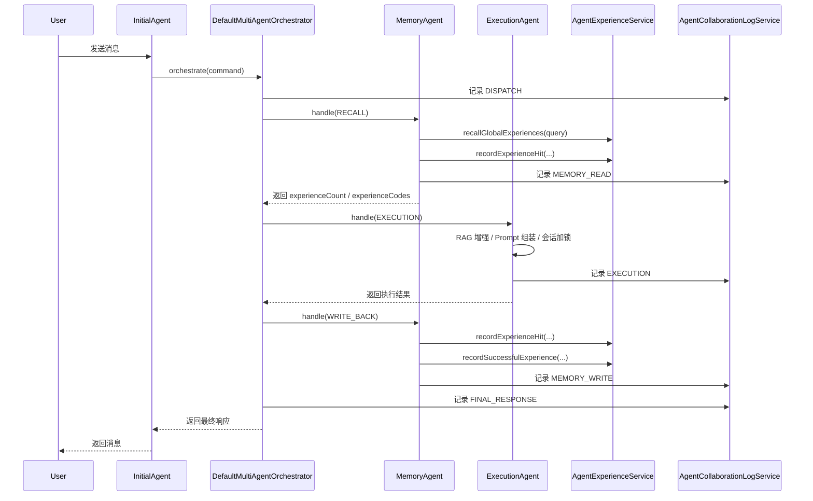

# 多智能体协作与自增强实现详解

> 适用仓库：`smartcrew-agent`  
> 关联提交：
> - `fd5cb76 feat: 实现多智能体协作编排与协作日志后台`
> - `ec7ee45 feat: 实现多智能体经验召回与沉淀服务`
> - `a7840e5 feat: 新增协作日志与经验池数据模型`
> - `c7bf11c chore: 忽略本地 worktree 工作目录`
> - `2f8d818 docs: 新增多智能体协作系统设计说明`

---

## 1. 文档目标

这篇文档不是产品说明，而是实现说明。重点回答四个问题：

1. 当前多智能体协作链路到底是怎么跑起来的。
2. `InitialAgent`、`ExecutionAgent`、`MemoryAgent` 各自承担什么责任，边界如何划分。
3. 系统所谓“越用越智能”在代码层面是如何落地的。
4. 这套实现现在解决了什么问题，未来还能往哪些方向扩展。

如果只想快速抓住重点，可以先看：

- 第 3 章：Agent 协作实现细节
- 第 4 章：自增强实现细节
- 第 7 章：当前局限与后续扩展方向

---

## 2. 背景与设计动机

在这次改造之前，系统的主链路更接近“单 Agent 对话入口”。这种实现能完成基本问答和工具调用，但有三个明显短板：

1. 调度职责、执行职责、经验职责混在一起，链路不清晰。
2. 没有稳定的协作日志，后台无法回答“这次请求到底经过了哪些步骤”。
3. 历史成功经验难以复用，系统无法把既往结果转化为后续协作的输入。

因此，这次实现把运行时改造成一个典型的“编排内核 + 专职 Agent”结构：

- `InitialAgent`：唯一用户入口，不再承担大部分业务细节。
- `DefaultMultiAgentOrchestrator`：运行时编排内核，负责协作顺序、上下文拼装、阶段元数据归并。
- `MemoryAgent`：负责经验召回、命中记录、成功经验沉淀。
- `ExecutionAgent`：负责实际执行，包括 Prompt 组装、RAG 增强、对话生成和兜底持久化。

这不是为了把一个简单调用拆复杂，而是为了让“入口决策”“执行生成”“经验利用”“协作审计”四条关注点分离。分离之后：

- 调度逻辑可以独立演进。
- 经验机制可以持续增强。
- 后台可以看见完整链路。
- 失败时更容易定位是记忆阶段、执行阶段还是入口编排阶段出了问题。

---

## 3. Agent 协作实现细节

### 3.1 角色与边界

#### 3.1.1 `InitialAgent`：唯一入口，尽量变薄

文件：`smartcrew-modules/src/main/java/com/smartcrew/agent/core/agent/InitialAgent.java`

当前 `InitialAgent` 的职责被显著收缩：

- 接收外部 `AgentDispatchCommand`
- 优先查找 `MultiAgentOrchestrator`
- 如果编排器存在，则把请求直接交给编排器
- 只有在编排器不可用时，才退化回旧的单 Agent 对话模式

这一步非常关键。它意味着：

- 系统层面只有一个正式用户入口，避免多个 Agent 同时面向用户造成入口不一致。
- 编排能力不是散落在多个 Agent 的 `handle()` 方法中，而是被集中托管。
- 入口层可以稳定承担后续更多职责，例如路由策略、限流策略、降级策略、风控审计等。

这也是为什么文档里把 `InitialAgent` 叫“统一入口”，而不是“主执行者”。

#### 3.1.2 `DefaultMultiAgentOrchestrator`：真正的运行时内核

文件：`smartcrew-modules/src/main/java/com/smartcrew/agent/core/collaboration/DefaultMultiAgentOrchestrator.java`

这是本次改造的核心。它不负责生成回复内容，但负责控制一次请求如何流经多个 Agent。

它做了几件事：

1. 从 `AgentRegistry` 中获取 `memory-agent` 和 `execution-agent`
2. 为本次请求记录 `DISPATCH` 协作日志
3. 调用 `MemoryAgent` 做经验召回
4. 从召回结果中提取：
   - `experienceCount`
   - `selectedExperienceCode`
5. 将这些信息注入到新的上下文里，再调用 `ExecutionAgent`
6. 执行结束后，再次调用 `MemoryAgent` 做 `WRITE_BACK`
7. 汇总执行结果，构造最终由 `initial-agent` 对外返回的 `AgentDispatchResponse`
8. 为最终返回记录 `FINAL_RESPONSE` 协作日志

可以把它理解为一台非常轻量的状态机。当前的状态转换是固定顺序：


这套顺序目前是串行的，不存在并发分支。这样做的好处是：

- 阶段边界清晰
- 上下文传播简单
- 日志时序稳定
- 失败路径容易处理

代价是：

- 总耗时是各阶段串联后的累计耗时
- 还没有做异步写回或并发召回

#### 3.1.3 `MemoryAgent`：经验读取器 + 经验沉淀器

文件：`smartcrew-modules/src/main/java/com/smartcrew/agent/core/agent/MemoryAgent.java`

`MemoryAgent` 是一个典型的“相位驱动型 Agent”。它通过上下文里的 `orchestratorPhase` 区分自己当前要做什么：

- `RECALL`
- `WRITE_BACK`

这意味着同一个 Agent 类承担两种角色，但角色切换是显式的，而不是隐式猜测。

在 `RECALL` 阶段，它会：

1. 读取用户消息
2. 组装 `AgentExperiencePoolQuery`
3. 从经验池召回候选经验
4. 记录每条命中经验的 `AgentExperienceHitLog`
5. 返回：
   - `experienceCount`
   - `experienceCodes`

在 `WRITE_BACK` 阶段，它会：

1. 读取编排器注入的 `selectedExperienceCode`
2. 读取执行摘要 `executionSummary`
3. 记录成功命中的经验日志
4. 构造或更新一条 `AgentExperiencePool`
5. 记录一条 `MEMORY_WRITE` 协作步骤日志

换句话说，`MemoryAgent` 既负责“把历史经验拿出来”，也负责“把这次成功经验放回去”。

#### 3.1.4 `ExecutionAgent`：真正生成结果的执行者

文件：`smartcrew-modules/src/main/java/com/smartcrew/agent/core/agent/ExecutionAgent.java`

`ExecutionAgent` 是这次链路里唯一真正做生成和执行的 Agent。

它负责：

1. 解析上下文中的阶段信息和经验信息
2. 计算 RAG 增强结果
3. 生成 `memoryId`
4. 拼装系统 Prompt
5. 对同一 `userId + sessionId` 加锁，保证会话级串行执行
6. 调用 `InitialAgentChatService`
7. 记录 `EXECUTION` 协作日志
8. 如果执行失败，则走 fallback 持久化

这里有两个实现细节值得特别注意：

##### A. 会话锁

`ExecutionAgent` 内部维护了：

```java
ConcurrentHashMap<String, ReentrantLock> conversationLocks
```

键是：

```java
userId + "::" + sessionId
```

这意味着同一用户同一会话内的执行是串行的。这样可以避免：

- 多个并发请求同时写同一个 LangChain 记忆上下文
- 同一会话消息顺序错乱
- 工具上下文互相覆盖

##### B. 执行失败的兜底持久化

如果执行阶段拿不到 `InitialAgentChatService`，或者调用过程中抛异常，系统不会直接丢失这次请求，而是会把用户消息和失败响应通过 `LlmConversationStore` 写回会话存储。

这能保证：

- 后台仍然看得到这次对话
- 用户消息不会因为模型异常彻底丢失
- 故障分析时能追到失败前的输入内容

---

### 3.2 协作上下文如何传递

多 Agent 链路能成立，核心不是“多几个类”，而是“上下文传递有约定”。

当前实现的上下文载体是 `AgentDispatchCommand.context`，编排器会在每次阶段切换时构造新上下文，并通过 `enrich(...)` 方法把已有上下文和新增上下文合并。

当前关键上下文字段包括：

- `orchestratorPhase`
  - `RECALL`
  - `EXECUTION`
  - `WRITE_BACK`
- `experienceCount`
- `selectedExperienceCode`
- `executionSummary`
- `experienceType`

这套约定的价值在于：

1. 每个 Agent 不需要知道完整的全局状态机
2. 只需要理解与自己相关的上下文字段
3. 编排器可以稳定做“阶段到上下文”的映射

这让当前架构具备一种很重要的扩展性：后面如果要增加 `PlannerAgent`、`ReviewerAgent` 或 `ToolPolicyAgent`，大概率只需要扩展上下文字段和阶段枚举，而不需要完全推翻主链路。

---

### 3.3 一次完整请求的执行时序

下面用一次标准请求来说明这条链路是如何运行的。



这个顺序背后有两个很强的工程判断：

1. **先记忆，后执行**
   - 目标是让执行阶段尽可能站在历史成功经验之上工作。
2. **执行后回写**
   - 目标是让这次结果进入经验体系，形成闭环。

如果把顺序搞反，例如先执行再召回，就失去了“经验参与本次调度”的意义；如果不做回写，就只剩一次性的召回，没有学习闭环。

---

### 3.4 协作日志是如何落下来的

协作日志不是一个附属功能，而是这套架构可维护性的基础。

当前日志通过 `AgentCollaborationLogService.createCollaborationLog(...)` 落库，写入表：

- `agent_collaboration_log`

关键字段包括：

- `trace_id`：一次协作链的全局追踪 ID
- `root_session_id`：对应会话 ID
- `agent_code`：哪个 Agent 负责当前步骤
- `step_type`：步骤类型
- `step_name`：步骤名称
- `status`：阶段状态
- `input_snapshot`
- `output_snapshot`
- `decision_snapshot`
- `error_message`
- `start_time`
- `end_time`
- `duration_ms`

当前步骤类型主要包括：

- `DISPATCH`
- `MEMORY_READ`
- `EXECUTION`
- `MEMORY_WRITE`
- `FINAL_RESPONSE`

这意味着后台能完整回答：

- 这次请求走没走经验召回？
- 执行阶段是否成功？
- 最终返回前有没有做经验回写？
- 每个阶段耗时多少？
- 每个阶段的输入、决策和输出摘要分别是什么？

这是多 Agent 系统和单 Agent 系统最本质的差异之一：系统不仅要能做事，还要能解释自己是怎么做成的。

---

## 4. 自增强实现细节

### 4.1 “自增强”在当前版本中的准确含义

这次实现里的“自增强”不是自动改 Prompt，也不是自动训练模型，而是一个更稳的版本：

1. 召回历史经验
2. 将经验作为本次协作的输入上下文
3. 记录经验命中
4. 对成功结果沉淀新经验或更新已有经验
5. 下次协作时优先使用命中概率更高的经验

所以，这里的“越用越智能”本质上是：

- 经验池越来越丰富
- 命中统计越来越准确
- 协作调度越来越贴近历史成功路径

这是典型的“基于经验存储的弱学习闭环”，而不是模型参数级学习闭环。

---

### 4.2 经验池：权威存储层

经验主存储在 MySQL 表：

- `agent_experience_pool`

它承担的是“事实库”职责，而不是全文搜索职责。

它存的不是一整段原始对话，而是“可复用经验卡片”。典型字段包括：

- `experience_code`
- `scope_type`
- `experience_type`
- `title`
- `trigger_pattern`
- `strategy_summary`
- `recommended_agent_code`
- `recommended_tool_codes`
- `success_sample`
- `failure_avoidance`
- `quality_score`
- `hit_count`
- `success_count`
- `last_used_at`
- `enabled`
- `source_trace_id`

这套设计有两个明显优点：

1. 经验被结构化了，适合筛选、排序、后台管理。
2. 经验不等于原始日志，避免把日志库直接当知识库使用。

当前默认是全局经验：

- `scope_type = GLOBAL`

也就是所有用户共享同一套经验池。这符合本次需求里“全局经验优先”的选择。

---

### 4.3 经验召回：先 MySQL 粗筛，再向量重排

经验召回的核心实现位于：

- `smartcrew-modules/src/main/java/com/smartcrew/agent/core/experience/AgentExperienceServiceImpl.java`

当前召回策略分两层：

#### 第一层：结构化筛选

先通过 MyBatis-Plus 查询经验池：

- 默认只查 `GLOBAL`
- 支持按 `experienceType` 过滤
- 支持 `enabled` 过滤
- 支持关键词模糊匹配
- 默认按以下顺序排序：
  - `qualityScore desc`
  - `successCount desc`
  - `hitCount desc`
  - `lastUsedAt desc`
  - `id desc`

这一步的意义是先把“明显不相关”或“低质量”的经验排除掉。

#### 第二层：向量重排

如果系统中存在：

- `EmbeddingService`
- `VectorStoreService`

则会对候选经验做一次语义重排：

1. 用用户消息生成查询向量
2. 在 `agent_experience_pool` 向量命名空间中搜索
3. 从匹配结果中提取 `experienceCode`
4. 按向量匹配结果重新排列候选经验

这里的重点不是“完全靠向量搜”，而是“先结构化收窄，再向量重排”。这是一种更稳的混合召回方案：

- MySQL 负责可控过滤
- 向量层负责语义相似性

这样可以避免两个极端：

1. 完全靠数据库模糊匹配，语义理解弱
2. 完全靠向量暴力召回，难以控制作用域和质量排序

---

### 4.4 经验命中：让系统知道哪些经验真的被用了

经验命中日志存储在：

- `agent_experience_hit_log`

`MemoryAgent` 在 `RECALL` 阶段会对每条被召回经验记录命中：

- `traceId`
- `experienceCode`
  - `agentCode = memory-agent`
- `appliedStage = RECALL`
- `appliedSnapshot = strategySummary`
- `successFlag = false`

注意这里的 `successFlag` 初始是 `false`。因为“被召回”不等于“被成功利用”。

后续在 `WRITE_BACK` 阶段，如果某条经验最终参与了成功执行，则会再次记录：

- `appliedStage = FINAL_RESPONSE`
- `successFlag = true`

这样一来，系统后面就能区分：

- 只是被召回过的经验
- 真正帮助完成任务的经验

这对后续做经验评分、经验淘汰、经验排序优化非常重要。

---

### 4.5 成功经验沉淀：把本次成功结果变成下次输入

`MemoryAgent.writeBack(...)` 是当前经验沉淀的入口。

它会读取：

- `selectedExperienceCode`
- `executionSummary`

然后构造一条 `AgentExperiencePool`，关键规则包括：

1. `experienceCode` 使用选中的经验编码
2. `scopeType = GLOBAL`
3. `experienceType` 继承上下文，默认 `COLLABORATION_STRATEGY`
4. `strategySummary` 优先使用执行摘要
5. `recommendedAgentCode = execution-agent`
6. `successSample = executionSummary`
7. `sourceTraceId = 当前 traceId`

真正落库时，`AgentExperienceServiceImpl.recordSuccessfulExperience(...)` 不会盲目插入新记录，而是先查：

- 是否已存在同 `experienceCode` 的经验

如果不存在：

- 插入一条新经验
- 初始化命中次数、成功次数、最近使用时间
- 同步向量索引

如果已存在：

- 合并新字段
- 累加 `hitCount`
- 累加 `successCount`
- 更新 `lastUsedAt`
- 同步向量索引

这个逻辑的工程含义是：

- 不把每次成功都存成碎片
- 尽量围绕同一经验编码做持续增强

这可以避免经验池快速膨胀成大量重复卡片。

---

### 4.6 为什么说这是一条“弱自增强闭环”

当前实现具备闭环，但还属于保守版本。

闭环已经形成的部分：

1. 请求进入系统
2. 经验被召回
3. 执行阶段消费经验上下文
4. 结果生成后记录成功命中
5. 成功结果沉淀回经验池
6. 新经验进入下次召回候选

尚未形成的部分：

1. 没有自动重新评估 `qualityScore`
2. 没有失败经验负反馈淘汰
3. 没有经验去重聚类
4. 没有动态挑选最佳 `recommendedToolCodes`
5. 没有用户级个性化经验池

所以当前版本更准确的说法是：

- 已经具备持续记忆和复用能力
- 但尚未进入“自动经验优化”的高级阶段

这正是它稳的地方。先把正向闭环跑通，再谈复杂学习策略，比一开始引入大而全的自学习机制更可控。

---

## 5. 数据与后台实现

### 5.1 协作日志后台查询

后台控制器：

- `smartcrew-admin/src/main/java/com/smartcrew/agent/controller/admin/AdminCollaborationLogController.java`

接口包括：

- `GET /api/admin/collaboration-logs`
- `GET /api/admin/collaboration-logs/{traceId}/steps`

服务实现：

- `AgentCollaborationLogServiceImpl`

支持：

- 分页查询协作日志概览
- 按 `traceId` 查询完整步骤时间线
- 按以下字段筛选：
  - `traceId`
  - `rootSessionId`
  - `agentCode`
  - `stepType`
  - `status`
  - `keyword`
  - `startTimeFrom`
  - `startTimeTo`

这使得后台不只是“看一条消息”，而是可以基于一次协作链做调试和审计。

### 5.2 后台前端页面

页面文件：

- `smartcrew-ui/src/views/admin/AdminCollaborationLogsView.vue`

页面结构采用左右双栏：

- 左侧：协作日志列表
- 右侧：选中 `traceId` 的步骤时间线

已接入：

- 路由：`/admin/collaboration-logs`
- 后台菜单入口
- 前端 API 封装
- 协作日志类型定义

这页的价值在于把“多 Agent 运行”从黑盒变成白盒。对于后续排查以下问题很有帮助：

- 为什么这次没有命中经验？
- 为什么经验命中了但执行失败？
- 为什么最终响应阶段耗时很长？
- 哪个 Agent 在本次协作里最慢？

---

## 6. 测试与验证策略

从最近几次提交可以看出，这套能力不是只补了实现，也补了验证面。

当前重点测试包括：

- `AgentExperienceServiceTests`
  - 验证经验召回与经验沉淀
- `MultiAgentCollaborationIntegrationTests`
  - 验证多 Agent 链路是否完整贯通
  - 验证步骤顺序是否为：
    - `DISPATCH`
    - `MEMORY_READ`
    - `EXECUTION`
    - `MEMORY_WRITE`
    - `FINAL_RESPONSE`
- `AdminCollaborationLogControllerTests`
  - 验证后台查询接口
- `AgentCollaborationExperienceMapperIntegrationTests`
  - 验证数据模型与持久层契约

这里尤其值得记录的一点是：本次实现中曾经出现过 `FINAL_RESPONSE` 排在链路前面的问题，根因不是业务顺序错了，而是日志时间戳取值不当。最终通过单独记录最终响应步骤的开始时间修正了时序问题。

这个案例说明，多 Agent 系统里“日志顺序正确”本身就是要测试的，而不是天然正确的。

---

## 7. 当前实现的局限

为了让后续扩展更可控，需要明确当前版本的边界。

### 7.1 编排仍然是固定串行流程

当前编排器的路线是写死的：

- 记忆召回
- 执行
- 记忆回写

这适合第一期，但还不支持：

- 根据任务类型动态跳过某个阶段
- 并发召回多个知识源
- 先规划再执行
- 执行后复审

### 7.2 经验评分仍偏静态

当前的 `qualityScore` 没有形成自动反馈调优机制，更多是占位和排序字段。

### 7.3 协作日志快照是摘要，不是原始全量链路

这是一个有意的取舍：

- 好处是可控、轻量、适合后台展示
- 代价是无法完整还原原始 Prompt、完整模型上下文、完整工具参数

### 7.4 记忆与执行耦合仍然存在于上下文字段约定中

虽然比单体逻辑清晰很多，但当前 `selectedExperienceCode`、`executionSummary` 等字段仍是编排器和 `MemoryAgent` 的隐式协议。后续如果 Agent 数量继续增加，最好把这套协议升级为显式的上下文对象或阶段 DTO。

### 7.5 经验写回还没有做污染控制

现在只要满足写回条件，就可能进入经验池。虽然已经比“每次都写全文”稳很多，但还没有做到：

- 低质量样本过滤
- 重复样本合并判定
- 失败样本负面沉淀
- 人工审核开关

---

## 8. 后续扩展方向

这一部分不是泛泛而谈，而是基于当前代码边界自然延伸出来的方向。

### 8.1 编排层扩展：从固定流水线到策略编排

当前 `DefaultMultiAgentOrchestrator` 可以演进为“可插拔编排器”：

- 为不同任务类型选择不同流程模板
- 增加 `PlannerAgent`
- 增加 `ReviewerAgent`
- 增加失败重试或回滚阶段

推荐的演进方向不是把现有类写得更大，而是把“阶段定义”和“阶段执行器”抽出来。

### 8.2 经验层扩展：从经验卡片到经验策略图谱

当前经验池是一维卡片结构，后续可以扩展为更强的关系结构，例如：

- 某类任务偏好哪种执行 Agent
- 某类任务常用哪些工具组合
- 某类失败应回退到哪些策略

这会让经验不只是“被召回”，而是能直接影响编排策略本身。

### 8.3 个性化经验层

当前是全局经验优先。后续可以扩展：

- `GLOBAL`
- `USER`
- `TEAM`

推荐召回顺序可以变成：

1. 用户级经验
2. 团队级经验
3. 全局经验

这样能兼顾复用率和个性化。

### 8.4 质量反馈与自动调优

后续可以在 `AgentExperienceServiceImpl` 上加：

- 成功率回写
- 负反馈降权
- 长期不用经验衰减
- 重复经验聚类
- 自动重算 `qualityScore`

一旦这些机制补齐，系统就不只是“存经验”，而是开始“筛经验、养经验、淘汰经验”。

### 8.5 更细粒度的协作可观测性

当前日志已经够做后台查询，但离线上诊断和性能分析还有距离。后续可以继续补：

- 工具调用级别的子步骤
- Prompt 版本号
- RAG 命中文档摘要
- 召回候选数量与重排前后变化
- 阶段失败分类码

这样后台不仅能看“发生了什么”，还能看“为什么发生”。

### 8.6 异步化与性能优化

当前链路是强同步的，后续性能优化的自然方向包括：

- `MEMORY_WRITE` 异步化
- 向量索引同步改成事件驱动
- 热门经验缓存
- 协作日志批量写入

但这些优化不应早于链路稳定性。当前阶段先把正确性跑通是更合理的顺序。

---

## 9. 总结

这次最近五个提交完成的，不只是“多了两个 Agent”，而是把系统从单入口单逻辑链，改造成了一套具备以下特征的运行时体系：

1. 有统一入口
2. 有编排内核
3. 有专职记忆与专职执行
4. 有协作日志
5. 有经验池
6. 有经验命中与成功沉淀
7. 有后台可观测能力

从工程成熟度看，这套实现已经跨过了“能跑”和“可维护”的分界线，但还没有走到“完全自优化”的阶段。

这也是当前版本最合理的位置：

- 先把协作边界、数据边界、日志边界、经验边界立住
- 再在这个稳定基础上持续增强编排策略和学习能力

如果后续继续扩展，最值得坚持的原则有两个：

1. 不要把新能力重新塞回 `InitialAgent`
2. 不要让经验池退化成原始日志堆积场

只要这两个原则守住，这套多智能体协作系统就还有很大的扩展空间。
