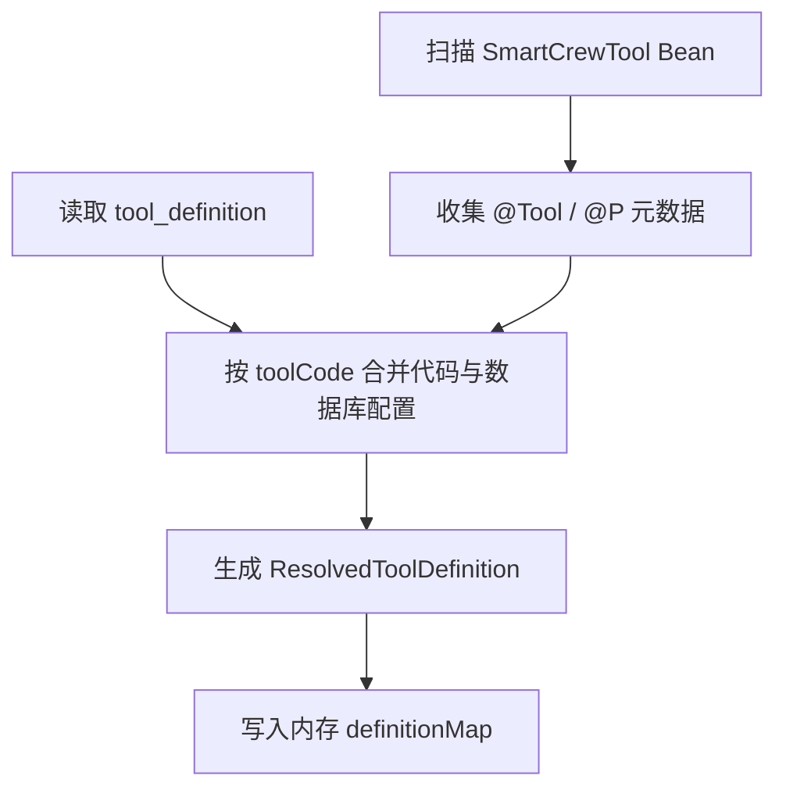

# Tool 元数据治理与 Agent 接入技术说明

> 版本：v2.0  
> 适用范围：SmartCrew Agent 后端 Tool 基础设施、后台配置接口、`initial-agent` 运行时接入  
> 目标读者：项目维护者、后端开发者、需要理解 Agent/Tool 编排链路的同学

---

## 1. 背景与目标

当前 Tool 体系的真实能力已经收敛为一条清晰主线：

- 代码层通过 `SmartCrewTool` + LangChain4j `@Tool` 暴露可执行能力
- 数据库层通过 `tool_definition` 做元数据治理与启停控制
- Agent 层通过 `agent_tool_binding` 约束当前 Agent 可使用的 Tool 集合

本次清理后的目标不是扩展新的 Tool 模式，而是把“代码能做什么”和“文档、页面、数据库怎么表达”彻底对齐：

1. Tool 执行只走代码 Bean，不再保留未采纳的历史执行语义。
2. `/api/v1/tools` 只承担元数据管理与启停兼容职责，不承载流程编排概念。
3. 后台页面展示运行时真相，帮助排查 Tool 是否可执行、为什么不可执行、来自哪里。

---

## 2. Tool 实现基础

### 2.1 Tool 的基本抽象

在本项目中，Tool 至少要回答四个问题：

| 维度 | 问题 | 本项目对应能力 |
| :--- | :--- | :--- |
| **定义** | Tool 是什么、叫啥、做什么 | `ToolDefinition`、`ResolvedToolDefinition` |
| **发现** | 系统里有哪些 Tool 可以用 | `ToolRegistry` |
| **执行** | 如何真正触发 Tool | `ToolExecutor`、`BeanToolExecutor` |
| **约束** | 哪个 Agent 可以用哪些 Tool | `agent_tool_binding`、`AgentToolBindingService` |

### 2.2 代码 Tool 的典型模式

代码 Tool 负责真正的执行能力，适合：

- 封装外部系统调用、复杂计算、风险操作
- 提供稳定、可测试、可审计的原子能力
- 通过动作级元数据暴露给后台和决策层

代码 Tool 的实现方式：

1. 实现 `SmartCrewTool` Bean。
2. 使用 `@Tool` 声明动作。
3. 使用 `@P` 补充参数说明。
4. 由 `InMemoryToolRegistry` 在启动和刷新时自动发现。

### 2.3 数据库 Tool 的典型模式

数据库配置不再承担执行流程定义，只负责治理信息：

- 覆盖 Tool 名称、描述、风险等级
- 控制启用/禁用状态
- 存储补充配置 `configJson`
- 为后台管理和 `/api/v1/tools` 提供统一入口

数据库配置必须指向可解析到的代码 Bean，系统不再支持“只有数据库、没有代码实现”的独立执行 Tool。

---

## 3. 本项目中的 Tool 体系设计

### 3.1 `tool_definition` 领域模型

当前 `tool_definition` 的核心字段为：

- `tool_code`
- `tool_name`
- `description`
- `bean_name`
- `risk_level`
- `enabled`
- `config_json`
- 审计字段

设计约束：

- `bean_name` 为必填，表示数据库配置始终绑定到代码 Bean

### 3.2 运行时统一视图：`ResolvedToolDefinition`

运行时不会直接把数据库实体当作可执行定义，而是统一收敛到 `ResolvedToolDefinition`。它会合并代码侧发现结果与数据库配置，补齐以下治理信息：

- `sourceStatus`：`CODE_ONLY` / `DB_ONLY` / `LINKED`
- `hasCodeBean`
- `hasDatabaseConfig`
- `executable`
- `resolveError`
- `actions`

这里的 `DB_ONLY` 表示“数据库中有元数据，但缺少对应代码实现”，用于后台诊断，不代表系统支持纯数据库执行。

### 3.3 Tool 来源解析规则

| 场景 | 结果 | 说明 |
| :--- | :--- | :--- |
| 只有代码 Tool，没有数据库配置 | `CODE_ONLY` | 可直接执行 |
| 同时存在代码与数据库配置 | `LINKED` | 元数据以数据库配置为准，执行走代码 Bean |
| 只有数据库配置，没有代码实现 | `DB_ONLY` + `executable=false` | 保留视图并给出 `resolveError` |

这套规则的目标是让后台和运行时都看到同一份“真实状态”，避免隐式兜底。

### 3.4 动作级元数据

`ToolActionMetadata` 用来描述某个 Tool 下的动作：

- `actionName`
- `description`
- `parameters`

动作来自代码 Bean 中的 `@Tool` 方法。这样 Agent 仍然按 Tool 级做绑定，决策层和后台则可以按动作级做展示与规划。

---

## 4. 运行时工作流程

### 4.1 Tool 注册与刷新

`InMemoryToolRegistry` 会：

1. 扫描所有 `SmartCrewTool` Bean
2. 反射收集 `@Tool` / `@P` 元数据
3. 读取 `tool_definition`
4. 按 `toolCode` 合并代码侧与数据库侧
5. 生成 `ResolvedToolDefinition`
6. 写入内存注册表



### 4.2 后台配置流程

后台 Tool 管理通过 `/api/admin/tools` 提供：

- `GET /api/admin/tools`
- `GET /api/admin/tools/{code}`
- `POST /api/admin/tools`
- `PUT /api/admin/tools/{code}`
- `POST /api/admin/tools/{code}/execute`

配置流程：

1. 后台提交 `ToolDefinitionRequest`
2. `ToolDefinitionServiceImpl` 校验基础字段与 `beanName`
3. 保存数据库配置
4. 调用 `toolRegistry.refresh()` 刷新运行时视图
5. 返回最新 `ToolDefinitionVo`

`ToolDefinitionVo` 是面向治理场景的运行时视图，会返回 `actions`、`sourceStatus`、`resolveError`、`executable` 等信息。

### 4.3 Tool 手动执行流程

后台调试入口：

- `POST /api/admin/tools/{code}/execute`

执行链路：

```text
AdminToolController
-> ToolExecutor
-> DefaultToolExecutor
-> BeanToolExecutor
-> ToolExecutionResult
```

统一执行协议：

```java
execute(toolCode, actionName, arguments, executionContext)
```

### 4.4 Agent 与 Tool 绑定流程

Agent 和 Tool 的绑定由 `AgentToolBindingService` 管理：

- `GET /api/admin/agents/{code}/tool-bindings`
- `PUT /api/admin/agents/{code}/tool-bindings`

运行时只会把“已绑定、已启用、可执行”的 Tool 暴露给 Agent。

### 4.5 `initial-agent` 的运行时接入

`initial-agent` 当前已经接入完整 Tool 闭环：


---

## 5. 关键实现细节

### 5.1 代码 Tool 的动作发现机制

`InMemoryToolRegistry` 通过反射读取公开方法上的 `@Tool` 注解，把方法签名转换为动作级元数据。参数会统一收敛为 `ToolActionParameter`，并优先读取 `@P` 上的说明。

### 5.2 统一执行协议

虽然 Tool 的具体动作可能不同，但执行入口统一为：

- `toolCode`
- `actionName`
- `arguments`
- `executionContext`

输出统一为 `ToolExecutionResult`，包含：

- `toolCode`
- `actionName`
- `success`
- `output`
- `errorMessage`
- `durationMs`

### 5.3 决策层的当前取舍

`ReActDecisionEngine` 当前仍是结构化启发式规划器，而不是完全依赖模型原生 function calling。这样做的目的是优先保证：

- 模型协议解耦
- 执行平面统一
- 权限、审计、风控更容易收敛
- 其他 Agent 后续更容易复用

### 5.4 `/api/v1/tools` 的兼容定位

兼容接口保留如下能力：

- `GET /api/v1/tools`
- `POST /api/v1/tools`
- `POST /api/v1/tools/{toolCode}/enable`
- `POST /api/v1/tools/{toolCode}/disable`

其定位已经明确为：

- Tool 元数据管理
- Tool 启停控制
- 兼容旧调用方

不再承载执行模式、流程编排或 DSL 语义。

---

## 6. 关键表结构与接口

### 6.1 数据表

#### `tool_definition`

职责：存储 Tool 数据库元数据配置。

当前关键字段：

- `tool_code`
- `tool_name`
- `description`
- `bean_name`
- `risk_level`
- `enabled`
- `config_json`

清理迁移：

- `sql/migrations/20260423_tool_bean_only_cleanup.sql`

历史说明：

- `sql/migrations/20260416_tool_dual_layer.sql` 为已废弃的历史迁移
- 旧版双模式字段已被 `20260423_tool_bean_only_cleanup.sql` 清理覆盖

#### `agent_tool_binding`

职责：维护 Agent 与 Tool 的绑定关系。

### 6.2 后台接口

#### Tool 管理

- `GET /api/admin/tools`
- `GET /api/admin/tools/{code}`
- `POST /api/admin/tools`
- `PUT /api/admin/tools/{code}`
- `POST /api/admin/tools/{code}/execute`

#### Agent-Tool 绑定

- `GET /api/admin/agents/{code}/tool-bindings`
- `PUT /api/admin/agents/{code}/tool-bindings`

#### 兼容接口

- `GET /api/v1/tools`
- `POST /api/v1/tools`
- `POST /api/v1/tools/{toolCode}/enable`
- `POST /api/v1/tools/{toolCode}/disable`

---

## 7. 本次实现的工程价值

这次收敛真正解决的是“Tool 体系看起来复杂，但运行事实并没有对齐”的问题。价值主要体现在：

1. 执行模型统一回到代码 Bean，消除伪复杂度。
2. 数据库配置明确定位为元数据治理，而不是半实现流程引擎。
3. 后台页面、接口、数据库字段、文档表述完全一致。
4. `/api/v1/tools` 兼容职责清晰，后续维护成本更低。

---

## 8. 后续扩展方向

### 8.1 升级规划器

后续可以把启发式 Planner 升级为结构化 LLM Planner，但不改变当前 Tool 的 BEAN-only 执行事实。

### 8.2 引入权限与风险控制

可以继续围绕 `riskLevel` 扩展：

- 按 Agent 限制高风险 Tool
- 按用户角色限制 Tool
- 执行前审批
- 审计日志与调用回放

### 8.3 支持 Action 级绑定

当前绑定粒度是 Tool 级，后续如出现更细颗粒度诉求，可在现有模型上继续扩展到 Action 级。

### 8.4 持续统一初始化基线

后续建议让主初始化脚本与增量迁移长期保持一致，避免新环境初始化时再次出现“字段已经删掉但文档还在”的认知偏差。

---

## 9. 风险与注意事项

1. `ReActDecisionEngine` 仍然是启发式 planner，复杂自然语言选 Tool 能力有限。
2. Tool 绑定目前是 Tool 级，不是 Action 级。
3. 只有数据库配置、没有代码实现的 Tool 仍会显示在后台，但不可执行。
4. 其他 Agent 如需接入 Tool 能力，仍需复用当前 orchestrator 骨架逐步接入。

---

## 10. 相关代码入口

### 10.1 领域与接口

- `smartcrew-modules-api/.../api/tool/domain/entity/ToolDefinition.java`
- `smartcrew-modules-api/.../api/tool/domain/model/ResolvedToolDefinition.java`
- `smartcrew-modules-api/.../api/tool/service/ToolRegistry.java`
- `smartcrew-modules-api/.../api/tool/service/ToolExecutor.java`
- `smartcrew-modules-api/.../api/decision/domain/vo/PlannedToolCall.java`

### 10.2 核心实现

- `smartcrew-modules/.../core/tool/InMemoryToolRegistry.java`
- `smartcrew-modules/.../core/tool/DefaultToolExecutor.java`
- `smartcrew-modules/.../core/tool/BeanToolExecutor.java`
- `smartcrew-modules/.../core/tool/ToolDefinitionServiceImpl.java`
- `smartcrew-modules/.../core/agent/service/AgentToolBindingServiceImpl.java`
- `smartcrew-modules/.../core/agent/service/AgentToolOrchestrator.java`
- `smartcrew-modules/.../core/decision/ReActDecisionEngine.java`
- `smartcrew-modules/.../core/agent/InitialAgent.java`

### 10.3 后台与测试

- `smartcrew-admin/.../controller/admin/AdminToolController.java`
- `smartcrew-admin/.../controller/tool/ToolController.java`
- `smartcrew-admin/.../test/java/com/smartcrew/agent/ToolInfrastructureIntegrationTests.java`
- `sql/migrations/20260423_tool_bean_only_cleanup.sql`

---

## 11. 一句话总结

这套 Tool 体系现在的本质，是“代码 Bean 提供执行能力，数据库提供元数据治理，Agent 提供白名单绑定”，三者共同构成一条可解释、可维护、可兼容的执行链路。
