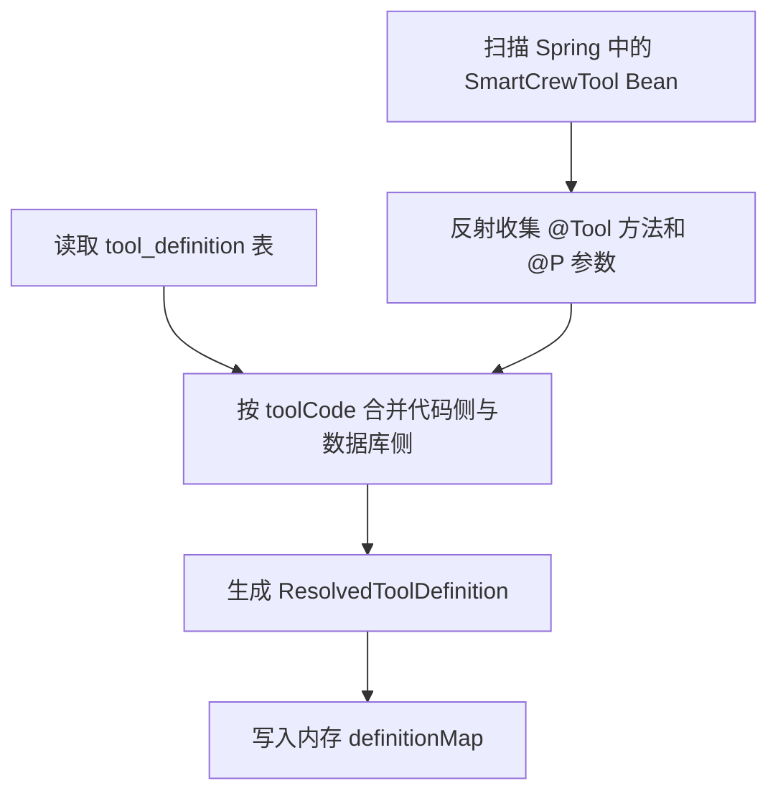
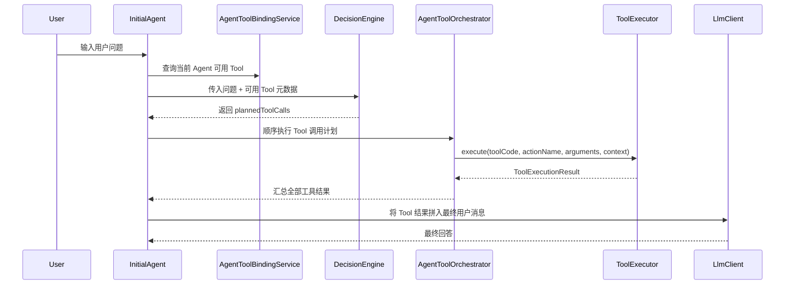

# Tool 双层配置与 Agent 接入技术说明

> 版本：v1.0  
> 适用范围：SmartCrew Agent 后端 Tool 基础设施、后台配置接口、`initial-agent` 运行时接入  
> 目标读者：项目维护者、后端开发者、需要理解 Agent/Tool 编排链路的同学

---

## 1. 背景与目标

本项目原本已经具备一套代码层 Tool 基础能力：

- 代码中可以通过 `SmartCrewTool` + LangChain4j `@Tool` 方法声明可调用工具
- 运行时存在 `ToolRegistry`、`ToolExecutor` 等抽象
- 数据库里已有 `tool_definition`、`agent_tool_binding` 等建模基础

但在旧实现下，Tool 体系还缺少三个关键闭环：

1. 数据库中的 Tool 配置无法真正表达“可执行流程”，更多只是元数据。
2. 没有代码 Bean 的数据库 Tool 不能独立执行。
3. Agent 虽然有 Tool 绑定表，但运行时并没有真正消费绑定关系，也没有形成“规划 -> 调用 -> 汇总”的完整链路。

这次升级的目标，就是把 Tool 做成与 Agent 类似的“双层来源体系”：

- 代码层：负责提供稳定、可复用、可测试的原子能力
- 数据库层：负责覆盖 Tool 元数据，或直接定义顺序流程型 Tool
- Agent 层：只绑定当前允许使用的 Tool 集合，运行时再由决策层选择具体动作

最终形成的能力是：

- 代码 Tool 无数据库配置时仍然可以直接被发现和调用
- 数据库 Flow Tool 没有代码 Bean 也可以独立运行
- 数据库配置和代码实现同时存在时，支持统一的覆盖与校验规则
- `initial-agent` 已经可以基于绑定 Tool 做一次结构化规划并执行 Tool，再把结果注入最终回答

---

## 2. Tool 实现基础

### 2.1 Tool 的基本抽象

在大多数 Agent 系统里，Tool 至少要回答四个问题：

| 维度 | 问题 | 本项目对应能力 |
| :--- | :--- | :--- |
| **定义** | Tool 是什么、叫啥、做什么 | `ToolDefinition`、`ResolvedToolDefinition` |
| **发现** | 系统里有哪些 Tool 可以用 | `ToolRegistry` |
| **执行** | 如何真正触发 Tool | `ToolExecutor` |
| **约束** | 哪个 Agent 可以用哪些 Tool | `agent_tool_binding`、`AgentToolBindingService` |

如果缺其中任何一层，Tool 就会退化成“只有定义不能执行”或者“只有代码没有运营配置”的半成品能力。

### 2.2 代码 Tool 的典型模式

代码 Tool 的优势是：

- 能力清晰，适合封装外部系统调用、复杂计算、风险操作
- 可测试性最好，便于做参数校验和权限控制
- 适合作为 Flow Tool 的原子步骤

本项目的代码 Tool 通过 `SmartCrewTool` 暴露基础属性，再通过 LangChain4j 的 `@Tool` 注解声明具体动作，`@P` 注解用于补充参数说明。运行时会反射收集这些方法，生成动作级元数据。

### 2.3 数据库 Tool 的典型模式

数据库 Tool 更偏向“配置型能力”，适合：

- 覆盖代码 Tool 的名称、描述、风险等级、启停状态
- 以低成本定义轻量工作流
- 给后台运营配置提供统一入口

这次升级后，数据库 Tool 不再只是静态描述，而是支持 `FLOW` 执行模式，可以直接保存顺序 DSL 并被执行器解释运行。

### 2.4 为什么要做双层配置

双层配置不是为了复杂而复杂，而是为了解决两个经常冲突的诉求：

- 工程侧希望 Tool 受代码治理，稳定、可测试、可审计
- 运营侧希望 Tool 元数据或流程可配置，不必每次改代码发版

本项目通过“代码层提供原子能力，数据库层负责绑定/覆盖/组装”的方式平衡这两个目标。这样既不会把所有逻辑都塞进数据库，也不会让所有配置变更都依赖后端发版。

---

## 3. 本项目中的 Tool 体系设计

### 3.1 领域模型升级

本次核心升级点在 `tool_definition` 表和对应领域对象。

当前 `ToolDefinition` 的关键字段包括：

- `toolCode`：Tool 唯一编码
- `toolName`：Tool 名称
- `description`：Tool 描述
- `beanName`：代码 Tool 对应的 Spring Bean 名称，`BEAN` 模式下使用
- `executionMode`：执行模式，当前支持 `BEAN` / `FLOW`
- `riskLevel`：风险等级
- `enabled`：是否启用
- `configJson`：运行时附加配置
- `flowDefinitionJson`：Flow Tool 的顺序 DSL 定义

其中最关键的变化是：

1. `executionMode` 成为一等字段，而不是继续隐含在 `configJson` 中。
2. `flowDefinitionJson` 单独承载流程 DSL，避免与普通配置混杂。
3. `beanName` 允许为空，从而支持“纯数据库 Flow Tool”。

### 3.2 运行时统一视图：ResolvedToolDefinition

数据库实体不能直接代表运行时可执行状态，所以注册中心会把代码侧与数据库侧合并为 `ResolvedToolDefinition`。它是 Tool 的“运行时真相”。

这个视图除了基础字段外，还包含：

- `sourceStatus`：`CODE_ONLY` / `DB_ONLY` / `LINKED`
- `hasCodeBean`
- `hasDatabaseConfig`
- `executable`
- `resolveError`
- `actions`

这样后台和运行时不需要自己再次拼装“这个 Tool 到底能不能执行、为什么不能执行、有哪些动作”。

### 3.3 Tool 来源解析规则

本项目的解析规则是显式且固定的：

| 场景 | 结果 | 说明 |
| :--- | :--- | :--- |
| 只有代码 Tool，没有数据库配置 | `CODE_ONLY` | 可直接调用 |
| 只有数据库配置，`executionMode=FLOW` | `DB_ONLY` | 走 Flow 执行器 |
| 同时存在代码与数据库配置，且 `executionMode=BEAN` | `LINKED` | 数据库元数据生效，执行走代码 Bean |
| 数据库存在但配置与运行时不匹配 | `DB_ONLY` 或 `LINKED` + `executable=false` | 保留视图，但明确给出 `resolveError` |

这里刻意没有做隐式兜底，比如“有 Flow 就自动覆盖 Bean”。原因是 Tool 是可执行能力，不应靠隐式推断决定最终执行主体。

### 3.4 动作级元数据

Tool 绑定仍然保持在 Tool 级别，但执行粒度已经细化到 Action 级别。

`ToolActionMetadata` 用来描述某个 Tool 下的具体动作，核心信息包括：

- `actionName`
- `description`
- `parameters`

代码 Tool 的动作来自 `@Tool` 方法反射结果；Flow Tool 当前默认暴露一个动作，名称默认是 `execute`，也可以在 Flow 定义里指定 `actionName`。

这样设计的价值在于：

- Agent 仍然只需要管理“允许使用哪些 Tool”
- 决策层可以根据动作级元数据做更细粒度的规划
- 后续如果要支持 action 级权限、action 级审计，不需要推翻当前模型

---

## 4. 运行时工作流程

### 4.1 Tool 注册与刷新

Tool 注册的核心入口是 `InMemoryToolRegistry`。它会在应用启动完成后刷新，并把代码 Tool 与数据库 Tool 合并成统一的运行时视图。

整体流程如下：



这个阶段完成后，后台列表、执行器、Agent 绑定服务读到的都是同一份解析结果。

### 4.2 后台配置流程

后台配置主要通过 `/api/admin/tools` 实现。

支持的接口有：

- `GET /api/admin/tools`
- `GET /api/admin/tools/{code}`
- `POST /api/admin/tools`
- `PUT /api/admin/tools/{code}`
- `POST /api/admin/tools/{code}/execute`

配置流程大致是：

1. 后台提交 `ToolDefinitionRequest`
2. `ToolDefinitionServiceImpl` 校验 `executionMode`
3. 如果是 `FLOW`，校验 `flowDefinitionJson` 的结构是否合法
4. 保存数据库配置
5. 调用 `toolRegistry.refresh()` 刷新运行时定义
6. 返回最新的 `ToolDefinitionVo`

`ToolDefinitionVo` 不只是数据库视图，而是一个偏“管理控制台”的运行时视图，因此会把 `actions`、`sourceStatus`、`resolveError`、`executable` 一并返回。

### 4.3 Tool 手动执行流程

后台手动执行 Tool 主要用于调试与验证，入口是：

- `POST /api/admin/tools/{code}/execute`

调用链为：

```text
AdminToolController
-> ToolExecutor
-> DefaultToolExecutor
-> BeanToolExecutor / FlowToolExecutor
-> ToolExecutionResult
```

统一执行入口使用：

```java
execute(toolCode, actionName, arguments, executionContext)
```

它的价值是把 Bean Tool 和 Flow Tool 都收敛到同一种调用协议上，便于 Agent 编排和后台调试复用同一条链路。

### 4.4 Agent 与 Tool 绑定流程

Agent 和 Tool 的绑定复用了现有“绑定关系表 + 独立服务层”的思路。

当前接口：

- `GET /api/admin/agents/{code}/tool-bindings`
- `PUT /api/admin/agents/{code}/tool-bindings`

服务层是 `AgentToolBindingService` / `AgentToolBindingServiceImpl`，主要职责包括：

- 查询某个 Agent 已绑定的 Tool
- 返回 `boundTools + availableTools` 两组视图，便于后台直接渲染
- 批量替换 Agent 的 Tool 绑定
- 过滤出已绑定、已启用、可执行的 Tool，供运行时使用

### 4.5 initial-agent 的运行时接入

当前 `initial-agent` 已经具备基础 Tool 编排闭环，流程如下：



这个编排并没有直接走模型原生 function calling，而是采用“规划一次 + 执行一次 + 总结一次”的通用骨架。这样做的好处是：

- 不把 Tool 调用逻辑强耦合到某一家模型协议
- 便于统一接入代码 Tool 和 Flow Tool
- 后续新 Agent 可以直接复用这套 orchestrator

---

## 5. 关键实现细节

### 5.1 代码 Tool 的动作发现机制

`InMemoryToolRegistry` 会扫描所有 `SmartCrewTool` Bean，并通过反射读取公开方法上的 LangChain4j `@Tool` 注解。

参数处理规则是：

- 每个方法参数都会被转换成 `ToolActionParameter`
- 参数名优先取 `@P` 注解补充的语义说明
- 当前统一按 `required=true` 输出到动作元数据

这一步的结果，是把“代码里的方法”转换成“运行时可以被 Agent 理解的动作描述”。

### 5.2 Flow DSL 的能力边界

当前 Flow Tool 是顺序 DSL，只支持三类步骤：

1. `template`
2. `tool_call`
3. `return`

示例：

```json
{
  "description": "包装服务器时间",
  "steps": [
    {
      "type": "tool_call",
      "toolCode": "basic",
      "actionName": "currentTime",
      "output": "now"
    },
    {
      "type": "return",
      "template": {
        "label": "server-time",
        "now": "{{vars.now}}"
      }
    }
  ]
}
```

这意味着当前 Flow Tool 更适合做：

- Tool 的串联编排
- 结果重新包装
- 轻量变量传递

而不适合做：

- 分支判断
- 循环
- 重试
- 直接 SQL / shell
- 任意脚本执行

这些能力如果确实需要，建议放回代码 Tool 中实现，再由 Flow Tool 调用。

### 5.3 模板渲染机制

`FlowToolExecutor` 支持基于模型上下文做 `{{...}}` 变量替换。

内置模型包括：

- `arguments`
- `context`
- `vars`
- `toolCode`
- `actionName`
- `lastResult`

示例：

- `{{arguments.keyword}}`
- `{{context.userId}}`
- `{{vars.now}}`

它既支持“整值替换”，也支持“嵌入字符串替换”。例如：

- `{{vars.now}}` 会直接返回变量原值
- `"当前时间：{{vars.now}}"` 会渲染成字符串

### 5.4 Bean Tool 与 Flow Tool 的统一执行协议

虽然底层执行方式不同，但 `ToolExecutor` 对外暴露的是统一协议：

- 指定 `toolCode`
- 指定 `actionName`
- 传入 `arguments`
- 传入 `executionContext`
- 返回 `ToolExecutionResult`

`ToolExecutionResult` 会统一携带：

- `toolCode`
- `actionName`
- `executionMode`
- `success`
- `output`
- `errorMessage`
- `durationMs`

这使得后台调试、Agent 编排、链路日志都可以围绕同一种结果格式展开。

### 5.5 决策层当前为何采用启发式规划

`ReActDecisionEngine` 已经不再只是占位实现，但目前仍然是“结构化启发式规划器”，而不是完全依赖 LLM 的 planner。

当前支持两类规划：

1. 显式调用
   - 例：`tool:basic#currentTime {}`
2. 启发式匹配
   - 例如识别“现在几点”映射到 `basic#currentTime`
   - 例如识别“生成ID”映射到 `basic#generateId`

之所以先这样落地，是因为本期目标是先打通 Tool 基础设施，而不是一次性把 planner 做成复杂的模型驱动系统。当前方案的优点是稳定、可控、容易调试。

### 5.6 兼容性处理

为避免破坏已有调用方，本次保留了旧的 `/api/v1/tools` 能力，并在 `ToolRegistry` 中保留了兼容视图能力。

同时，`ToolExecutor` 也保留了旧签名：

```java
execute(toolCode, arguments)
```

它在内部会自动转发到新签名。这种做法保证了基础设施升级后，旧链路不会被一次性打断。

---

## 6. 关键表结构与接口

### 6.1 数据表

#### `tool_definition`

职责：存储 Tool 的数据库配置定义。

新增或强化的关键字段：

- `bean_name`
- `execution_mode`
- `flow_definition_json`

这部分通过增量迁移脚本维护：

- `sql/migrations/20260416_tool_dual_layer.sql`

#### `agent_tool_binding`

职责：维护 Agent 与 Tool 的绑定关系。

当前绑定粒度是 Tool 级，而不是 Action 级。

### 6.2 后台接口

#### Tool 管理

- `GET /api/admin/tools`
- `GET /api/admin/tools/{code}`
- `POST /api/admin/tools`
- `PUT /api/admin/tools/{code}`
- `POST /api/admin/tools/{code}/execute`

#### Agent-Tool 绑定

- `GET /api/admin/agents/{code}/tool-bindings`
- `PUT /api/admin/agents/{code}/tool-bindings`

#### 兼容接口

- `GET /api/v1/tools`

---

## 7. 本次实现的工程价值

从工程视角看，这次 Tool 升级真正解决的是“可执行能力如何配置化接入 Agent”的问题。

它带来的价值主要有四点：

1. **从单一代码 Tool 升级为双层配置体系**  
   Tool 不再只有代码声明，而是具备了数据库侧元数据覆盖与流程定义能力。

2. **从静态描述升级为可执行配置**  
   数据库中的 Flow Tool 已经能独立执行，不再只是展示用配置。

3. **从 Tool 清单升级为 Agent 可消费能力池**  
   Agent 不再面对“系统里所有 Tool”，而是面对“当前绑定且可执行的 Tool 子集”。

4. **从占位集成升级为编排闭环**  
   `initial-agent` 已经可以完成规划、执行、结果注入三步闭环，为后续 Agent 扩展打下基础。

---

## 8. 后续扩展方向

### 8.1 把启发式 Planner 升级为 LLM 结构化规划

当前决策层已经有了 `PlannedToolCall` 这类结构化输出模型，后续可以直接把 planner 升级为：

- LLM 输出结构化 JSON 计划
- 服务端做 schema 校验和安全裁剪
- 再交给 orchestrator 执行

这样会比关键词启发式更灵活，也更适合多 Tool 场景。

### 8.2 扩展 Flow DSL 的控制能力

未来可以在不破坏现有 DSL 的前提下扩展：

- `if`
- `switch`
- `foreach`
- `retry`
- `parallel`

但建议循序渐进，避免过早把 Flow Tool 演化成通用脚本引擎。

### 8.3 引入权限与风险控制

当前已经有 `riskLevel` 字段，后续可以继续向下扩展：

- 按 Agent 限制高风险 Tool
- 按用户角色限制 Tool
- 执行前审批
- 审计日志与调用回放

这样 Tool 体系才能真正走向生产级治理。

### 8.4 支持 Action 级绑定

当前绑定粒度是 Tool 级，已经足够覆盖大多数基础场景。后续如果出现“一个 Tool 下某些动作可用、某些动作禁用”的诉求，可以在当前模型上继续往 Action 级细化。

### 8.5 增加管理端页面

本期只做了后端 API，没有新增前端管理界面。后续可以围绕下面几个方向补 UI：

- Tool 列表与详情页
- Flow DSL 编辑与调试页
- Agent-Tool 绑定页
- Tool 执行记录页

### 8.6 统一初始化脚本基线

当前主初始化脚本 `sql/init-smartcrew-agent.sql` 没有直接重写，而是补了增量迁移脚本。这是出于历史编码与修改风险考虑做的保守处理。后续建议在合适时机整理一份新的完整初始化基线，减少新环境搭建的心智负担。

---

## 9. 风险与注意事项

1. 当前 `ReActDecisionEngine` 仍然是启发式 planner，复杂自然语言选 Tool 能力有限。
2. Flow DSL 目前只支持顺序编排，不适合承载复杂流程控制。
3. Tool 绑定目前是 Tool 级，不是 Action 级。
4. 主初始化脚本尚未并入最新 Tool 字段，当前依赖增量迁移脚本补齐。
5. `initial-agent` 已接入 Tool 编排，但其他 Agent 还需要后续按同一骨架逐步接入。

---

## 10. 相关代码入口

### 10.1 领域与接口

- `smartcrew-modules-api/.../api/tool/domain/entity/ToolDefinition.java`
- `smartcrew-modules-api/.../api/tool/domain/model/ResolvedToolDefinition.java`
- `smartcrew-modules-api/.../api/tool/service/ToolRegistry.java`
- `smartcrew-modules-api/.../api/tool/service/ToolExecutor.java`
- `smartcrew-modules-api/.../api/decision/domain/vo/PlannedToolCall.java`

### 10.2 核心实现

- `smartcrew-modules/.../core/tool/InMemoryToolRegistry.java`
- `smartcrew-modules/.../core/tool/DefaultToolExecutor.java`
- `smartcrew-modules/.../core/tool/BeanToolExecutor.java`
- `smartcrew-modules/.../core/tool/FlowToolExecutor.java`
- `smartcrew-modules/.../core/tool/ToolDefinitionServiceImpl.java`
- `smartcrew-modules/.../core/agent/service/AgentToolBindingServiceImpl.java`
- `smartcrew-modules/.../core/agent/service/AgentToolOrchestrator.java`
- `smartcrew-modules/.../core/decision/ReActDecisionEngine.java`
- `smartcrew-modules/.../core/agent/InitialAgent.java`

### 10.3 后台与测试

- `smartcrew-admin/.../controller/admin/AdminToolController.java`
- `smartcrew-admin/.../controller/admin/AdminAgentController.java`
- `smartcrew-admin/.../test/java/com/smartcrew/agent/ToolInfrastructureIntegrationTests.java`
- `sql/migrations/20260416_tool_dual_layer.sql`

---

## 11. 一句话总结

这套 Tool 体系的本质，是把“可执行能力”从单纯代码实现，升级成“代码原子能力 + 数据库流程配置 + Agent 绑定编排”的三层闭环，并且已经在 `initial-agent` 上完成了第一条可运行链路。
